# LAMP STACK IMPLEMENTATION ON AWS

## What is a technology stack?
A technology stack is a set of frameworks and tools used to develop a software product. This set of frameworks and tools are very specifically chosen to work together in creating a well-functioning software.

## What is a LAMP STACK?
LAMP is an acronym for (Linux, Apache, MySQL, PHP/Perl/Python) denoting one of the most common technology stacks for many of the web's most popular applications.

Each letter in the acronym stands for one of its four open-source building blocks:

- Linux for the operating system
- Apache HTTP Server
- MySQL for the relational database management system
- PHP, Perl, or Python programming language

### Prerequisite :wrench:
- AWS Account

## Launch EC2 on AWS
- Login to the aws account
- Select region from the left hand corner of the dashboard
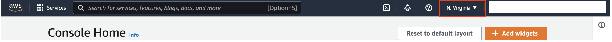

- Create a keypair from the ec2 instance dashboard and download it

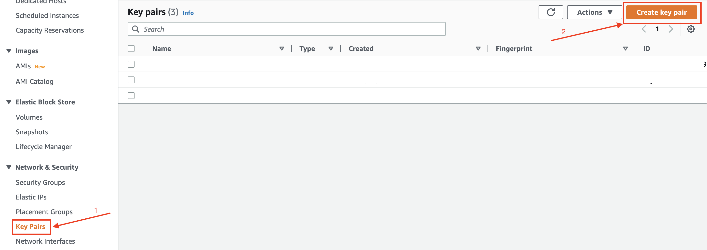
- Launch an ec2 instance of t2.micro family with ubuntu server 20.04 LTS (HVM)
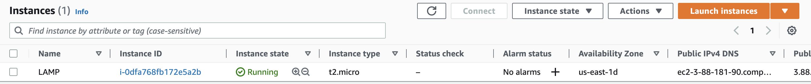

## SSH into the instance
- Open terminal on your local system and navigate to the folder where the key pair is downloaded
```
$ cd ~/Downloads
```
- Change permissions for private key file (.pem)
```
$ chmod 0400 <private-key-name>.pem
```
- Connect to the instance by running
```
$ ssh -i <private-key-name>.pem ubuntu@<public-ip-address>
```
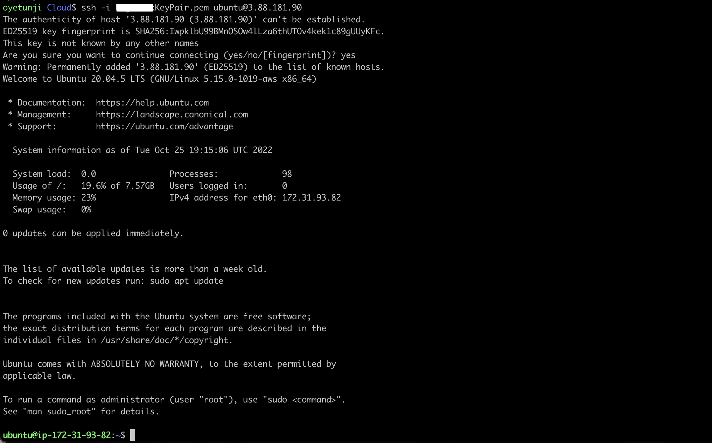

## Install Apache
- Update the list of packages in the package manager using;
```
$ sudo apt update
```
- Install apache2 using ubuntu package manager
```
$ sudo apt install apache2 -y
```
- verify apache2 is running
```
$ sudo systemctl status apache2
```
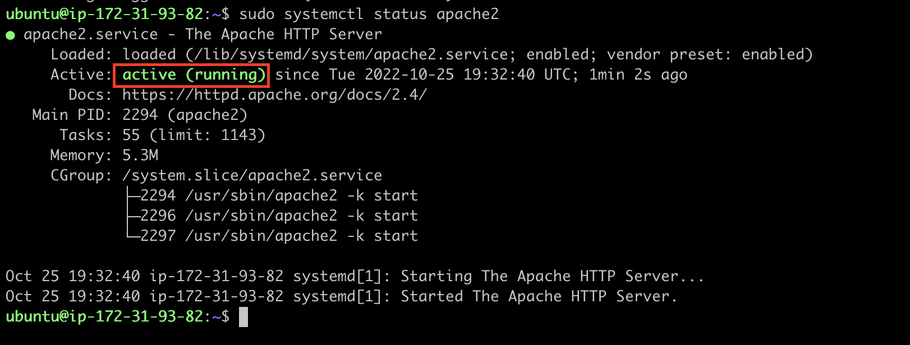

## Edit the security group inbound rule to allow http connection
- Select the ec2 instance and navigate to the security tab in the ec2 instance dashboard then select the security group
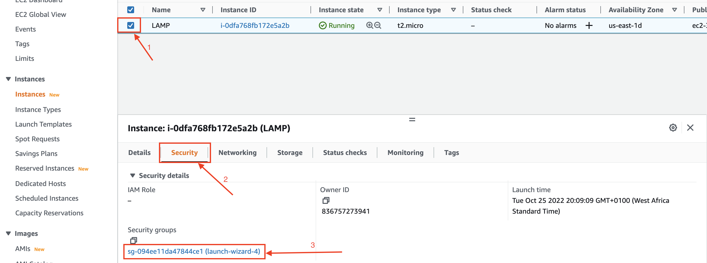
- Edit the inbound rule and add rule to allow http connection on tcp port 80 then click save
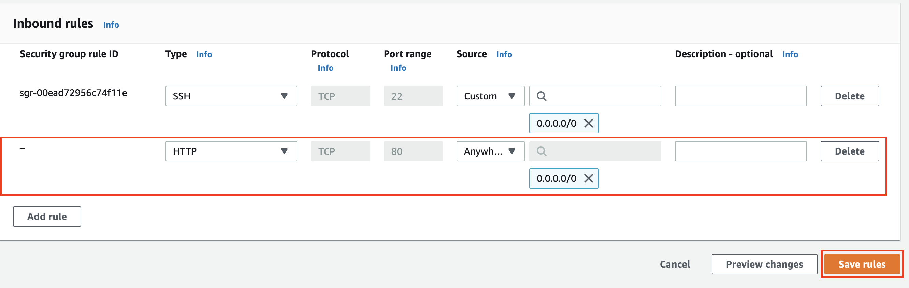
- Access your web server either locally using this command `curl http://localhost:80  or curl http://127.0.0.1:80 ` or on your web browser by accessing the following ip address `http://<Public-IP-Address>:80`. If you see following page, then your web server is now correctly installed and accessible through your firewall.
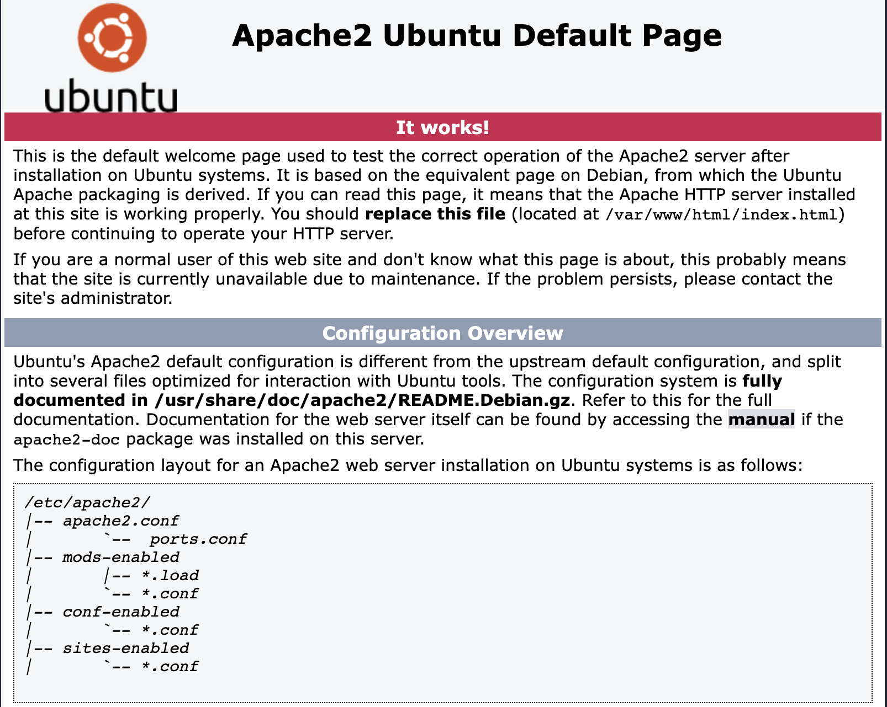

## Install MySQL and run security script
- Install mysql using the ubuntu package manager
```
$ sudo apt install mysql-server
```
and when prompted, confirm installation by typing _Y_ and _ENTER_
- Login to mysql console after the installation is finished using the command;
```
$ sudo mysql
```
- Set a password for the root user, using mysql_native_password as default authentication method to run the security script that comes pre-installed with MySQL. This script will remove some insecure default settings and lock down access to your database system.
```
mysql > ALTER USER 'root'@'localhost' IDENTIFIED WITH mysql_native_password BY 'password';
```
> Replace 'password' with any password of your choice

- Exit the MySQL shell with:
```
mysql > exit
```
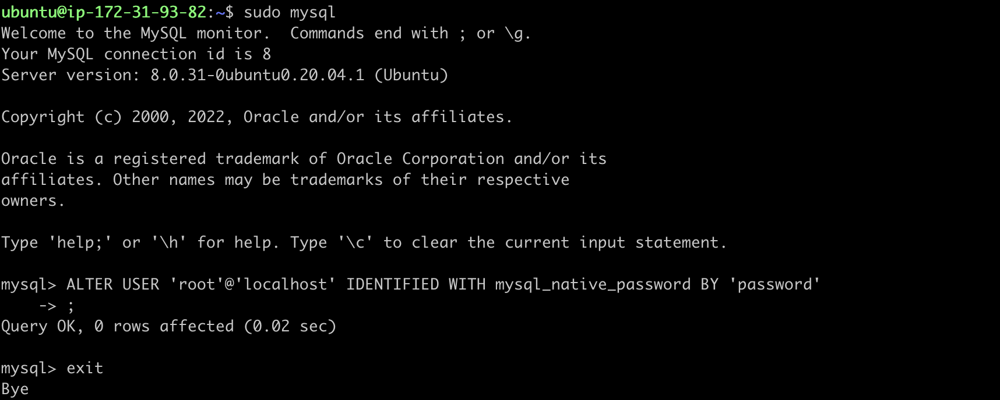
- Start the interractive security script by running;
```
$ sudo mysql_secure_installation
```
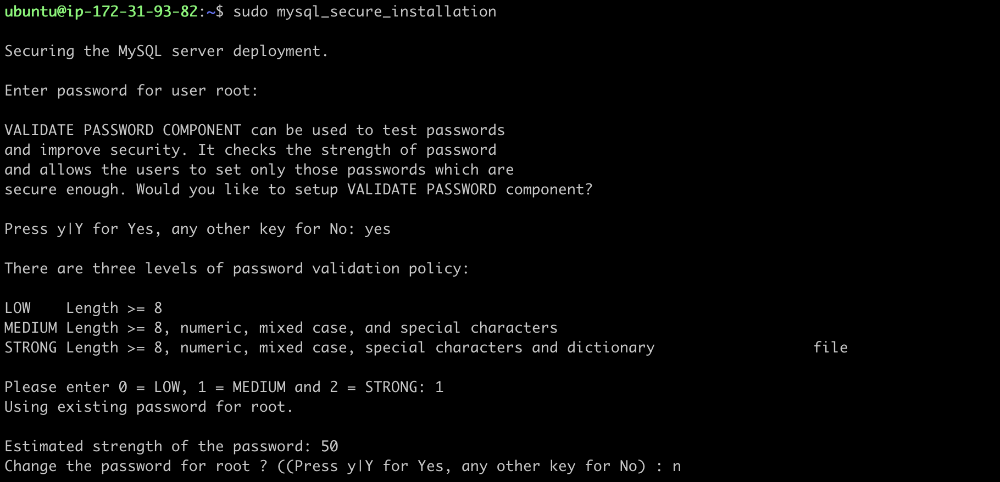
- Press _Y_ and hit _ENTER_ for the rest of the question
> This will prompt you to change the root password, remove some anonymous users and the test database, disable remote root logins, and load these new rules so that MySQL immediately respects the changes you have made.
- Verify if you are able to login to mysql console by typing the following command then enter your password;
```
$ mysql -u root -p
```
then enter the password
- Exit mysql console
```
mysql > exit
```
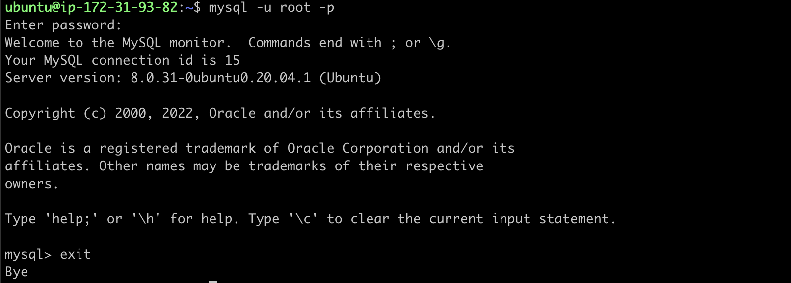

## Install PHP
PHP is the component of our setup that will process code to display dynamic content to the end user. In addition to the php package, you’ll need php-mysql which allows PHP to communicate with MySQL-based databases. You’ll also need libapache2-mod-php to enable Apache to handle PHP files.

- Install the 3 PHP packages
```
$ sudo apt install php libapache2-mod-php php-mysql
```
- Confirm your PHP version
```
php -v
```
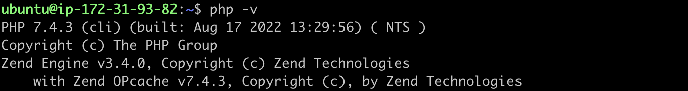

At this point, the LAMP stack is completely installed and fully operational.

## Create a virtual host using apache
In this step, you will set up a domain called `projectlamp`, but you can replace this with any name of your choice.

Apache on Ubuntu 20.04 has one server block enabled by default that is configured to serve documents from the `/var/www/html` directory.
You can leave this configuration as it is and add your own directory next to the default one.

- Create a directory for projectlamp in the `www` folder
```
$ sudo mkdir /var/www/projectlamp
```
- Assign the ownership of the directory to your current system user
```
$ sudo chown -R $USER:$USER /var/www/projectlamp
```
- Create and open a new configuration file in Apache’s sites-available directory using your preferred command-line editor (e.g vim).
```
$ sudo vi /etc/apache2/sites-available/projectlamp.conf
```
- Press _i_ to enter the insert mode and paste in the following configuration;
```
<VirtualHost *:80>
    ServerName projectlamp
    ServerAlias www.projectlamp 
    ServerAdmin webmaster@localhost
    DocumentRoot /var/www/projectlamp
    ErrorLog ${APACHE_LOG_DIR}/error.log
    CustomLog ${APACHE_LOG_DIR}/access.log combined
</VirtualHost>
```
- Save and close the file, simply by hitting _esc_ button and type `:wq` then hit _ENTER_ key
- confirm the presence of the configuration file using `ls` command
```
$ sudo ls /etc/apache2/sites-available
```
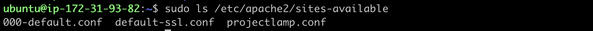

With this VirtualHost configuration, Apache will serve projectlamp using /var/www/projectlamp as its web root directory.

- Enable the new virtual host using `a2ensite` command.
```
$ sudo a2ensite projectlamp
```
- Disable the default website that comes installed with Apache using `a2dissite` command
```
$ sudo a2dissite 000-default
```
- Confirm your configuration file doesn’t contain syntax errors by running;
```
$ sudo apache2ctl configtest
```
- Reload Apache so these changes take effect
```
$ sudo systemctl reload apache2
```
- Create an index.html file in the projectlamp directory to test if the virtual host works as expected
```
sudo echo 'Hello LAMP from hostname' $(curl -s http://169.254.169.254/latest/meta-data/public-hostname) 'with public IP' $(curl -s http://169.254.169.254/latest/meta-data/public-ipv4) > /var/www/projectlamp/index.html
```
- Now go to your browser and try to open your website URL using IP address
```
http://<Public-IP-Address>:80
```
If you see the text from ‘echo’ command you wrote to index.html file, then it means your Apache virtual host is working as expected.

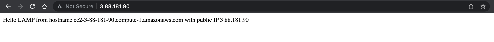

You can also access your website in your browser by public DNS name and the result must be the same

```
http://<Public-DNS-Name>:80
```

## Enable PHP on the website
> With the default DirectoryIndex settings on Apache, a file named index.html will always take precedence over an index.php file. This is useful for setting up maintenance pages in PHP applications, by creating a temporary index.html file containing an informative message to visitors. Because this page will take precedence over the index.php page, it will then become the landing page for the application. Once maintenance is over, the index.html is renamed or removed from the document root, bringing back the regular application page.

> In case you want to change this behavior, you’ll need to edit the /etc/apache2/mods-enabled/dir.conf file and change the order in which the index.php file is listed within the DirectoryIndex directive:
```
sudo vi /etc/apache2/mods-enabled/dir.conf
```
```
<IfModule mod_dir.c>
        #Change this:
        #DirectoryIndex index.html index.cgi index.pl index.php index.xhtml index.htm
        #To this:
        DirectoryIndex index.php index.html index.cgi index.pl index.xhtml index.htm
</IfModule>
```
> After saving and closing the file, you will need to reload Apache so the changes take effect:
```
sudo systemctl reload apache2
```
- Create a new file named index.php inside your custom web root folder
```
vi /var/www/projectlamp/index.php
```
- Paste the following code into the file
```
<?php
phpinfo();
```
- Save and close the file. Then refresh the page and you should have a page similar to this

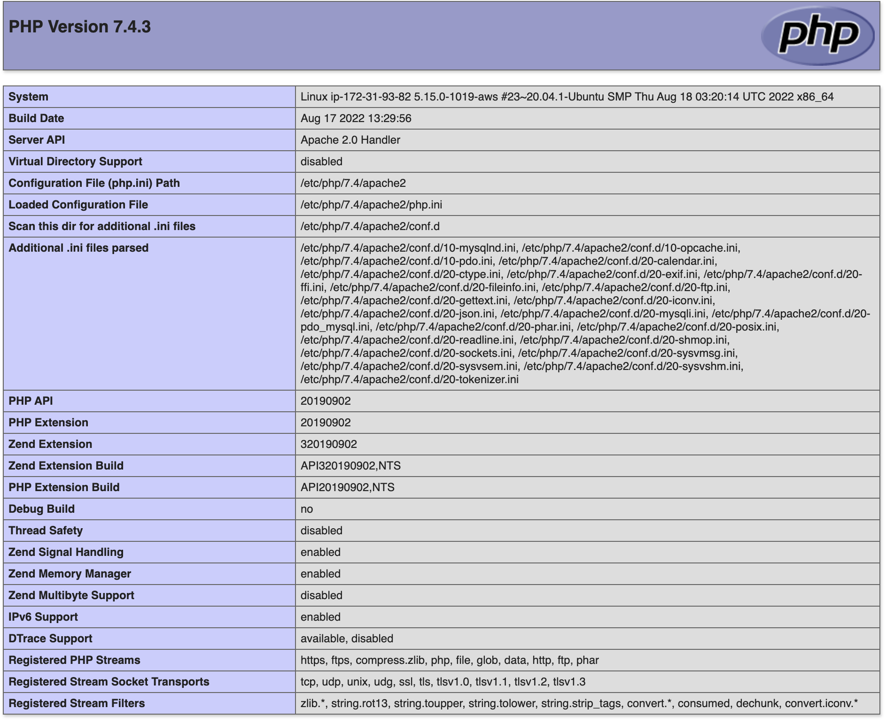

> This page provides information about your server from the perspective of PHP. It is useful for debugging and to ensure that your settings are being applied correctly. If you can see this page in your browser, then your PHP installation is working as expected.

> After checking the relevant information about your PHP server through that page, it’s best to remove the file you created as it contains sensitive information about your PHP environment -and your Ubuntu server. You can use `rm` to do so:
```
sudo rm /var/www/projectlamp/index.php
```