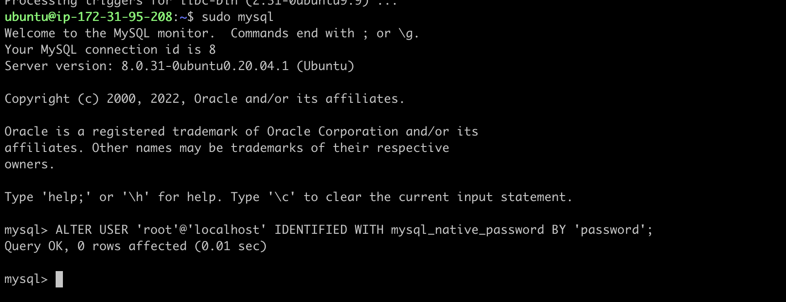
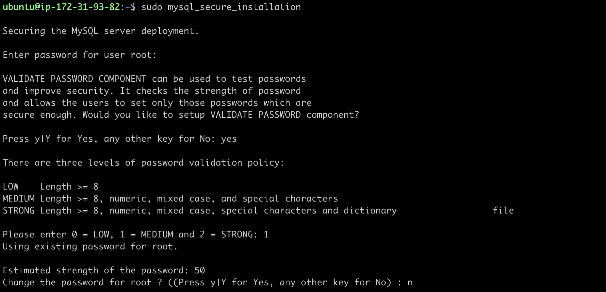
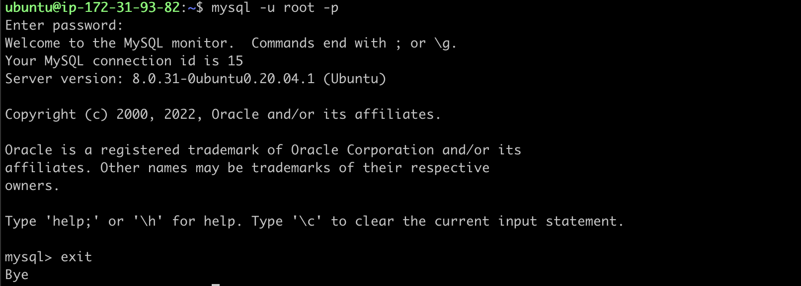
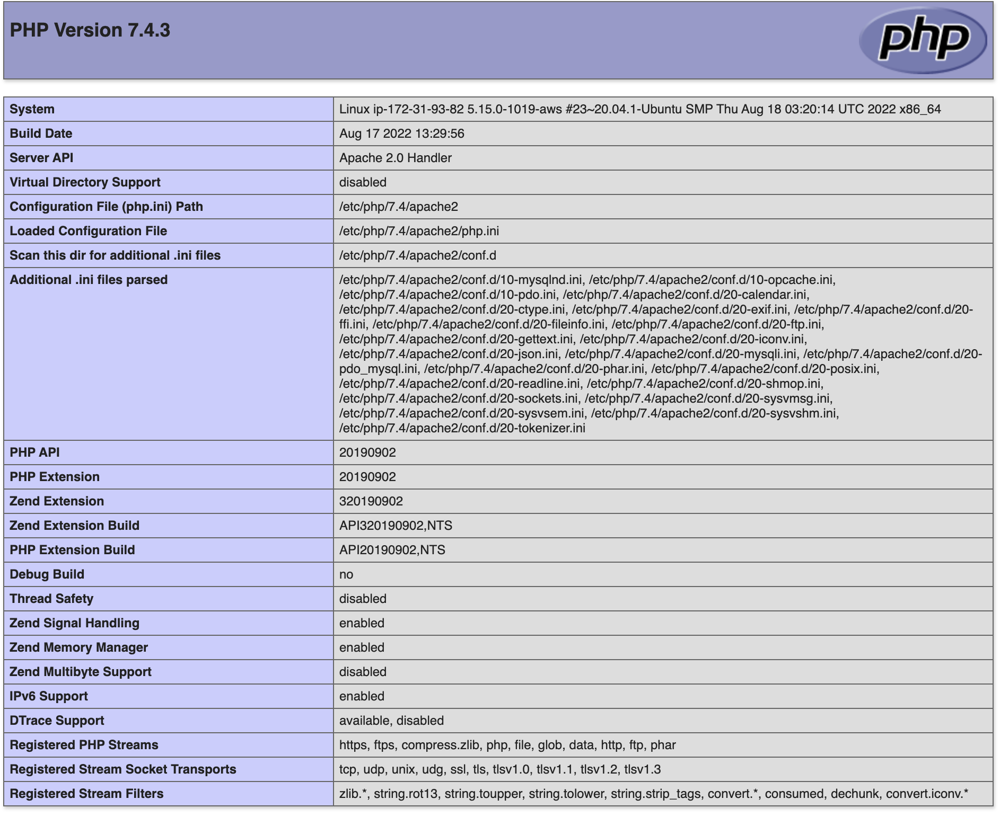

# LEMP STACK IMPLEMENTATION ON AWS

## What is a LEMP STACK?
The LEMP stack is a group of software that can be used to serve dynamic web pages and web applications. This is an acronym that describes a Linux operating system, with an Nginx (pronounced like “Engine-X”) web server. The backend data is stored in the MySQL database and the dynamic processing is handled by PHP.

### Prerequisite :wrench:
- AWS Account

## Launch EC2 on AWS
- Login to the aws account
- Select region from the right hand corner of the dashboard


- Create a keypair from the ec2 instance dashboard and download it


- Launch an ec2 instance of t2.micro family with ubuntu server 20.04 LTS (HVM)


## SSH into the instance
- Open terminal on your local system and navigate to the folder where the key pair is downloaded
```
$ cd ~/Downloads
```
- Change permissions for private key file (.pem)
```
$ chmod 0400 <private-key-name>.pem
```
- Connect to the instance by running
```
$ ssh -i <private-key-name>.pem ubuntu@<public-ip-address>
```


## Install nginx
- Update the list of packages in the package manager using
```
$ sudo apt update
```
- Install nginx using ubuntu package manager
```
$ sudo apt install nginx -y
```
- verify nginx is running
```
$ sudo systemctl status nginx
```


## Edit the security group inbound rule to allow http connection
- Select the ec2 instance and navigate to the security tab in the ec2 instance dashboard then select the security group

- Edit the inbound rule and add rule to allow http connection on tcp port 80 then click save

- Access your web server either locally using this command `curl http://localhost:80  or curl http://127.0.0.1:80 ` or on your web browser by accessing the following ip address `http://<Public-IP-Address>:80`. If you see following page, then your web server is now correctly installed and accessible through your firewall.


## Install MySQL and run security script
- Install mysql using the ubuntu package manager
```
$ sudo apt install mysql-server -y
```
- Login to mysql console after the installation is finished using the command;
```
$ sudo mysql
```
- Set a password for the root user, using mysql_native_password as default authentication method to run the security script that comes pre-installed with MySQL. This script will remove some insecure default settings and lock down access to your database system.
```
mysql> ALTER USER 'root'@'localhost' IDENTIFIED WITH mysql_native_password BY 'password';
```
> Replace 'password' with any password of your choice

- Exit the MySQL shell with:
```
mysql> exit
```

- Start the interractive security script by running;
```
$ sudo mysql_secure_installation
```

- Press _Y_ and hit _ENTER_ for the rest of the question
> This will prompt you to change the root password, remove some anonymous users and the test database, disable remote root logins, and load these new rules so that MySQL immediately respects the changes you have made.
- Verify if you are able to login to mysql console by typing the following command then enter your password;
```
$ mysql -u root -p
```
then enter the password
- Exit mysql console
```
mysql> exit
```


## Install PHP
You have Nginx installed to serve your content and MySQL installed to store and manage your data. Now you can install PHP to process code and generate dynamic content for the web server.

Nginx requires an external program to handle PHP processing and act as a bridge between the PHP interpreter itself and the web server. This allows for a better overall performance in most PHP-based websites, but it requires additional configuration. You’ll need to install php-fpm, which stands for “PHP fastCGI process manager”, and tell Nginx to pass PHP requests to this software for processing. Additionally, you’ll need php-mysql, a PHP module that allows PHP to communicate with MySQL-based databases. Core PHP packages will automatically be installed as dependencies.

- Install the 2 PHP packages
```
$ sudo apt install php-fpm php-mysql -y
```
- Confirm your PHP version
```
php -v
```


## Configure nginx to use php processor
> When using the Nginx web server, we can create server blocks to encapsulate configuration details and host more than one domain on a single server. In this guide, we will use projectlemp as an example domain name.

> On Ubuntu 20.04, Nginx has one server block enabled by default and is configured to serve documents out of a directory at /var/www/html. While this works well for a single site, it can become difficult to manage if you are hosting multiple sites. Instead of modifying /var/www/html, we’ll create a directory structure within /var/www for the projectlemp website, leaving /var/www/html in place as the default directory to be served if a client request does not match any other sites.

- Create a directory for projectlemp in the `www` folder
```
$ sudo mkdir /var/www/projectlemp
```
- Assign the ownership of the directory to your current system user
```
$ sudo chown -R $USER:$USER /var/www/projectlemp
```
- Create and open a new configuration file in nginx's sites-available directory using your preferred command-line editor (e.g vim).
```
$ sudo vi /etc/nginx/sites-available/projectlemp
```
- Press _i_ to enter the insert mode and paste in the following configuration;
```
#/etc/nginx/sites-available/projectlemp

server {
    listen 80;
    server_name projectlemp www.projectlemp;
    root /var/www/projectlemp;

    index index.html index.htm index.php;

    location / {
        try_files $uri $uri/ =404;
    }

    location ~ \.php$ {
        include snippets/fastcgi-php.conf;
        fastcgi_pass unix:/var/run/php/php7.4-fpm.sock;
     }

    location ~ /\.ht {
        deny all;
    }

}
```
> Check the php version installed in your server and edit the line "fastcgi_pass unix:/var/run/php/php7.4-fpm.sock" to "fastcgi_pass unix:/var/run/php/php(version)-fpm.sock;"
- Save and close the file, simply by hitting _esc_ button and type `:wq` then hit _ENTER_ key
- Activate your configuration by linking to the config file from Nginx’s sites-enabled directory
```
sudo ln -s /etc/nginx/sites-available/projectlemp /etc/nginx/sites-enabled/
```
- Confirm your configuration file doesn’t contain syntax errors by running;
```
$ sudo nginx -t
```

- Disable default Nginx host that is currently configured to listen on port 80
```
sudo unlink /etc/nginx/sites-enabled/default
```
- Reload nginx so these changes take effect
```
$ sudo systemctl reload nginx
```
- Create an index.html file in the projectlemp directory to test the new server block
```
sudo echo 'Hello LEMP from hostname' $(curl -s http://169.254.169.254/latest/meta-data/public-hostname) 'with public IP' $(curl -s http://169.254.169.254/latest/meta-data/public-ipv4) > /var/www/projectlemp/index.html
```
- Now go to your browser and try to open your website URL using IP address
```
http://<Public-IP-Address>:80
```
If you see the text from ‘echo’ command you wrote to index.html file, then it means your nginx server block is working as expected.


You can also access your website in your browser by public DNS name and the result must be the same
```
http://<Public-DNS-Name>:80
```

## Test php on nginx
> You can test to validate that Nginx can correctly handle .php files off to your PHP processor. You can do this by creating a test PHP file in your document root. 

- Open a new file called info.php within your document root in your text editor:
```
sudo vi /var/www/projectlemp/info.php
```
- Paste the following code into the file
```
<?php
phpinfo();
```
- Save and close the file. You can now access this page in your web browser by visiting the domain name or public IP address you’ve set up in your Nginx configuration file, followed by /info.php:
```
http://`server_domain_or_IP`/info.php
```
- Save and close the file. Then refresh the page and you should have a page similar to this



> This page provides information about your server from the perspective of PHP. It is useful for debugging and to ensure that your settings are being applied correctly. If you can see this page in your browser, then your PHP installation is working as expected.

> After checking the relevant information about your PHP server through that page, it’s best to remove the file you created as it contains sensitive information about your PHP environment -and your Ubuntu server. You can use `rm` to do so:
```
sudo rm /var/www/projectlamp/index.php
```