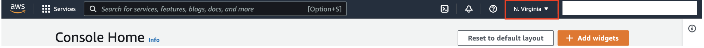
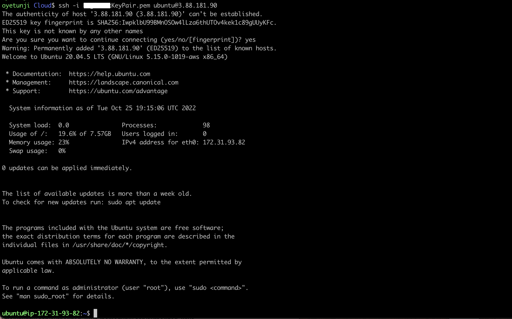
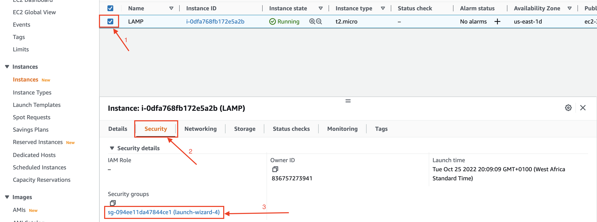
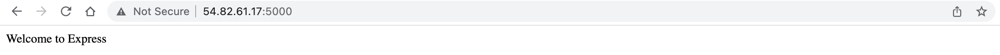

# SIMPLE TO-DO APPLICATION ON MERN WEB STACK

## Components of MERN Web stack

- __MongoDB__: A document-based, No-SQL database used to store application data in a form of documents.

- __ExpressJS__: A server side Web Application framework for Node.js.

- __ReactJS__: A frontend framework developed by Facebook. It is based on JavaScript, used to build User Interface (UI) components.

- __Node.js__: A JavaScript runtime environment. It is used to run JavaScript on a machine rather than in a browser.

> A user interacts with the ReactJS UI components at the application front-end residing in the browser. This frontend is served by the application backend residing in a server, through ExpressJS running on top of NodeJS. Any interaction that causes a data change request is sent to the NodeJS based Express server, which grabs data from the MongoDB database if required, and returns the data to the frontend of the application, which is then presented to the user.

### Prerequisite :wrench:
- AWS Account

## Launch EC2 on AWS
- Login to the aws account
- Select region from the right hand corner of the dashboard


- Create a keypair from the ec2 instance dashboard and download it

- Launch an ec2 instance of t2.micro family with ubuntu server 20.04 LTS (HVM)


## SSH into the instance
- Open terminal on your local system and navigate to the folder where the key pair is downloaded
```
$ cd ~/Downloads
```
- Change permissions for private key file (.pem)
```
$ chmod 0400 <private-key-name>.pem
```
- Connect to the instance by running
```
$ ssh -i <private-key-name>.pem ubuntu@<public-ip-address>
```



## Configure Backend
- Update the list of packages in the package manager using
```
$ sudo apt update
```
- Upgrade ubuntu
```
$ sudo apt upgrade
```
- Get the location of Node.js software from [Ubuntu repositories](https://github.com/nodesource/distributions#deb).
```
$ curl -fsSL https://deb.nodesource.com/setup_18.x | sudo -E bash -
```
### Install nodejs on the server
- Install Node.js on the server with the command below
```
$ sudo apt-get install -y nodejs
```
> The command above installs both nodejs and npm. NPM is a package manager for Node like apt for Ubuntu, it is used to install Node modules & packages and to manage dependency conflicts.

- Verify the node installation with the command below
```
$ node -v
``` 
Verify the npm installation with the command below
```
$ npm -v 
```
### Setup Application Code
- Create a new directory for your To-Do project
```
$ mkdir Todo
```
- Verify that the Todo directory is created with `ls` command
```
$ ls
```

- Change your current directory to the newly created `Todo` directory:
```
$ cd Todo
```
- Use the command `npm init` to initialise your project
> This command will create a new file named package.json. This file will normally contain information about your application and the dependencies that it needs to run. Follow the prompts after running the command. You can press Enter several times to accept default values, then accept to write out the package.json file by typing yes.
```
$ npm init
```


- Run the command `ls` to confirm that you have package.json file created.
```
$ ls
```

### Install Expressjs
- Install express using npm
```
$ npm install express
```
- Create a file index.js
```
$ touch index.js
```
- Install the dotenv module
```
$ npm install dotenv
```
- Open the index.js file
```
$ vi index.js
```
- Copy the code below and paste it in the file 
```
const express = require('express');
require('dotenv').config();

const app = express();

const port = process.env.PORT || 5000;

app.use((req, res, next) => {
res.header("Access-Control-Allow-Origin", "\*");
res.header("Access-Control-Allow-Headers", "Origin, X-Requested-With, Content-Type, Accept");
next();
});

app.use((req, res, next) => {
res.send('Welcome to Express');
});

app.listen(port, () => {
console.log(`Server running on port ${port}`)
});
```
> Notice that we have specified to use port 5000 in the code. This will be required later when we go on the browser.

- Type `:wq` then _ENTER_ to save and close the file

- Start your server to see if it works. Open your terminal in the same directory as your index.js file and type the follwing command.
```
$ node index.js
```
 If every thing goes well, you should see `Server running on port 5000` in your terminal.


### Edit the security group inbound rule to allow tcp port 5000
- Select the ec2 instance and navigate to the security tab in the ec2 instance dashboard then select the security group

- Edit the inbound rule and add rule to allow http connection on tcp port 5000 then click save

- Open up your browser and try to access your server’s Public IP or Public DNS name followed by port 5000: 
```
http://<PublicIP-or-PublicDNS>:5000
```


### Create routes
There are three actions that our To-Do application needs to be able to do:

- Create a new task
- Display list of all tasks
- Delete a completed task

Each task will be associated with some particular endpoint and will use different standard HTTP request methods: POST, GET and DELETE. For each task, we need to create routes that will define various endpoints that the To-do app will depend on. 

- Create a folder routes
```
$ mkdir routes
```
- Change directory to `routes` folder.
```
$ cd routes
```
- Create a file `api.js` with the command below
```
$ touch api.js
```
- Open the file with the command below
```
$ vi api.js
```
- Copy the code below into the file
```
const express = require ('express');
const router = express.Router();

router.get('/todos', (req, res, next) => {

});

router.post('/todos', (req, res, next) => {

});

router.delete('/todos/:id', (req, res, next) => {

})
module.exports = router;
```
### Create Models
Since the app is going to make use of Mongodb which is a NoSQL database, we need to create a model. A model is at the heart of JavaScript based applications, and it is what makes it interactive.

We will also use models to define the database schema . This is important so that we will be able to define the fields stored in each Mongodb document.

In essence, the Schema is a blueprint of how the database will be constructed, including other data fields that may not be required to be stored in the database. These are known as virtual properties.

- Change directory back to `Todo` folder with `cd ..` and install Mongoose
```
$ cd ..

$ npm install mongoose
```
- Create a new folder `models`
```
$ mkdir models
```
- Change directory into the newly created `models` folder with
```
$ cd models
```
- Inside the models folder, create a file and name it `todo.js`
```
$ touch todo.js
```

- Open the file created with `vi todo.js` then paste the code below in the file:
```
const mongoose = require('mongoose');
const Schema = mongoose.Schema;

//create schema for todo
const TodoSchema = new Schema({
action: {
type: String,
required: [true, 'The todo text field is required']
}
})

//create model for todo
const Todo = mongoose.model('todo', TodoSchema);

module.exports = Todo;
```

- Update the routes from the file `api.js` in `routes` directory to make use of the new model. In the `routes` directory, open `api.js` with `vi api.js`, delete the code inside with `:%d` command and paste the below code into it then save and exit.
```
const express = require ('express');
const router = express.Router();
const Todo = require('../models/todo');

router.get('/todos', (req, res, next) => {

//this will return all the data, exposing only the id and action field to the client
Todo.find({}, 'action')
.then(data => res.json(data))
.catch(next)
});

router.post('/todos', (req, res, next) => {
if(req.body.action){
Todo.create(req.body)
.then(data => res.json(data))
.catch(next)
}else {
res.json({
error: "The input field is empty"
})
}
});

router.delete('/todos/:id', (req, res, next) => {
Todo.findOneAndDelete({"_id": req.params.id})
.then(data => res.json(data))
.catch(next)
})

module.exports = router;
```

### Create Mongodb database
We need a database to store our data. For this we will make use of mLab. mLab provides MongoDB database as a service solution (DBaaS), so to make things easy, we will need to sign up for a shared clusters free account, which is ideal for our use case. Sign up [here](https://www.mongodb.com/atlas-signup-from-mlab) and follow the sign up process, select AWS as the cloud provider and choose a region near you.

- Complete a get started checklist as shown on the image below


- Allow access to the MongoDB database from anywhere (_Not secure, but it is ideal for testing_) and change the time of deleting the entry from 6 Hours to 1 Week


- Create a MongoDB database and collection inside mLab


- Create a file in your `Todo` directory and name it `.env`
```
$ vi .env
```
- Copy the database connection and paste it in the file. Ensure to update the password.
```
DB = 'mongodb+srv://<username>:<password>@<network-address>/<dbname>?retryWrites=true&w=majority'
```
Ensure to update <username> and <password> according to your setup


- Update the `index.js` to reflect the use of `.env` so that Node.js can connect to the database. Simply delete existing content in the file, and update it with the entire code below.
```
const express = require('express');
const bodyParser = require('body-parser');
const mongoose = require('mongoose');
const routes = require('./routes/api');
const path = require('path');
require('dotenv').config();

const app = express();

const port = process.env.PORT || 5000;

//connect to the database
mongoose.connect(process.env.DB, { useNewUrlParser: true, useUnifiedTopology: true })
.then(() => console.log(`Database connected successfully`))
.catch(err => console.log(err));

//since mongoose promise is depreciated, we overide it with node's promise
mongoose.Promise = global.Promise;

app.use((req, res, next) => {
res.header("Access-Control-Allow-Origin", "\*");
res.header("Access-Control-Allow-Headers", "Origin, X-Requested-With, Content-Type, Accept");
next();
});

app.use(bodyParser.json());

app.use('/api', routes);

app.use((err, req, res, next) => {
console.log(err);
next();
});

app.listen(port, () => {
console.log(`Server running on port ${port}`)
});
```
- Start your server using the command:
```
$ node index.js
```

If you see a message like the image above, you have the backend configured.

### Test Backend Code Using Restful API

We have written backend part of our To-Do application, and configured a database, but we do not have a frontend UI yet. We need ReactJS code to achieve that. But during development, we will need a way to test our code using RESTfulL API. Therefore, we will need to make use of some API development client to test our code.

In this project, we will use [Postman](https://www.getpostman.com/) to test our API.
Click [Install Postman](https://www.getpostman.com/download) to download and install postman on your machine.

Click [HERE](https://www.youtube.com/watch?v=JzpFsrZnNDo&t=0s) to learn how perform CRUD operartions on Postman

- Open your Postman, create a POST request to the API `http://<PublicIP-or-PublicDNS>:5000/api/todos`. This request will sends a new task to our To-Do list so the application could store it in the database.


- Create a GET request to your API on `http://<PublicIP-or-PublicDNS>:5000/api/todos`. This request retrieves all existing records from our To-do application.


- Create a DELETE request to your API on `http://<PublicIP-or-PublicDNS>:5000/api/todos/:_id` and add the `_id` to the path variable. This request delete the record in which the id is specified.


We have tested the backend part of our To-Do application and have made sure that it supports all three operations we wanted.

## Create Frontend

- Make sure you are in `Todo` directory, then run:
```
 $ npx create-react-app client
 ```
This will create a new folder in your Todo directory called `client`, where you will add all the react code.

### Run a React App
Before running the react app, there are some dependencies that need to be installed.

- Install concurrently which allows running more than one command simultaneously from the same terminal window.
```
$ npm install concurrently --save-dev
```
- Install nodemon to run and monitor the server. If there is any change in the server code, nodemon will restart it automatically and load the new changes.
```
$ npm install nodemon --save-dev
```
- Open the `package.json` file in the `Todo` directory. Change the highlighted part of the below screenshot and replace with the code below.
```
"scripts": {
"start": "node index.js",
"start-watch": "nodemon index.js",
"dev": "concurrently \"npm run start-watch\" \"cd client && npm start\""
},
```


### Configure Proxy in package.json
- Change directory to `client`
```
$ cd client
```
- Open the package.json file
```
$ vi package.json
```
- Add this key value pair in the package.json file `"proxy": "http://localhost:5000"`.
> The whole purpose of adding the proxy configuration above is to make it possible to access the application directly from the browser by simply calling the server url like http://localhost:5000 rather than always including the entire path like http://localhost:5000/api/todos

- Ensure you are inside the `Todo` directory and simply run the following command:
```
$ npm run dev
```
Your app should open and start running on localhost:3000

- Open TCP port 3000 on EC2 by adding a new Security Group rule.

### Creating your React Components
One of the advantages of react is that it makes use of components, which are reusable and also makes code modular. For our Todo app, there will be two stateful components and one stateless component.
- From your Todo directory, run
```
$ cd client
```
- move to the src directory
```
$ cd src
```
- Create another folder called `components` inside your `src` folder
```
$ mkdir components
```
- Move into the `components` directory with
```
$ cd components
```
Create three files `Input.js`, `ListTodo.js` and `Todo.js` inside `components` directory 
```
$ touch Input.js ListTodo.js Todo.js
```
- Open `Input.js` file
```
$ vi Input.js
```
- Copy and paste the following code:
```
import React, { Component } from 'react';
import axios from 'axios';

class Input extends Component {

state = {
action: ""
}

addTodo = () => {
const task = {action: this.state.action}

    if(task.action && task.action.length > 0){
      axios.post('/api/todos', task)
        .then(res => {
          if(res.data){
            this.props.getTodos();
            this.setState({action: ""})
          }
        })
        .catch(err => console.log(err))
    }else {
      console.log('input field required')
    }

}

handleChange = (e) => {
this.setState({
action: e.target.value
})
}

render() {
let { action } = this.state;
return (
<div>
<input type="text" onChange={this.handleChange} value={action} />
<button onClick={this.addTodo}>add todo</button>
</div>
)
}
}

export default Input
```

- Move to the src folder
```
$ cd ..
```
- Move to clients folder
```
$ cd ..
```
- Install Axios
```
$ npm install axios
```

- Go to `components` directory
```
$ cd src/components
```
- Open your ListTodo.js
```
$ vi ListTodo.js
```
- Copy and paste the following code;
```
import React from 'react';

const ListTodo = ({ todos, deleteTodo }) => {

return (
<ul>
{
todos &&
todos.length > 0 ?
(
todos.map(todo => {
return (
<li key={todo._id} onClick={() => deleteTodo(todo._id)}>{todo.action}</li>
)
})
)
:
(
<li>No todo(s) left</li>
)
}
</ul>
)
}

export default ListTodo
```
- Open your Todo.js
```
vi Todo.js
```
- Copy and paste the following code;

```
import React, {Component} from 'react';
import axios from 'axios';

import Input from './Input';
import ListTodo from './ListTodo';

class Todo extends Component {

state = {
todos: []
}

componentDidMount(){
this.getTodos();
}

getTodos = () => {
axios.get('/api/todos')
.then(res => {
if(res.data){
this.setState({
todos: res.data
})
}
})
.catch(err => console.log(err))
}

deleteTodo = (id) => {

    axios.delete(`/api/todos/${id}`)
      .then(res => {
        if(res.data){
          this.getTodos()
        }
      })
      .catch(err => console.log(err))

}

render() {
let { todos } = this.state;

    return(
      <div>
        <h1>My Todo(s)</h1>
        <Input getTodos={this.getTodos}/>
        <ListTodo todos={todos} deleteTodo={this.deleteTodo}/>
      </div>
    )

}
}

export default Todo;
```

We need to make little adjustment to our react code. We want to delete the logo and adjust our App.js.

- Move to the src folder
```
$ cd ..
```
- Make sure that you are in the src folder and run
```
$ vi App.js
```
- Copy and paste the code below into it.
```
import React from 'react';

import Todo from './components/Todo';
import './App.css';

const App = () => {
return (
<div className="App">
<Todo />
</div>
);
}

export default App;
```

- Open the App.css file
```
$ vi App.css
```
- Paste the following code into App.css:
```
.App {
text-align: center;
font-size: calc(10px + 2vmin);
width: 60%;
margin-left: auto;
margin-right: auto;
}

input {
height: 40px;
width: 50%;
border: none;
border-bottom: 2px #101113 solid;
background: none;
font-size: 1.5rem;
color: #787a80;
}

input:focus {
outline: none;
}

button {
width: 25%;
height: 45px;
border: none;
margin-left: 10px;
font-size: 25px;
background: #101113;
border-radius: 5px;
color: #787a80;
cursor: pointer;
}

button:focus {
outline: none;
}

ul {
list-style: none;
text-align: left;
padding: 15px;
background: #171a1f;
border-radius: 5px;
}

li {
padding: 15px;
font-size: 1.5rem;
margin-bottom: 15px;
background: #282c34;
border-radius: 5px;
overflow-wrap: break-word;
cursor: pointer;
}

@media only screen and (min-width: 300px) {
.App {
width: 80%;
}

input {
width: 100%
}

button {
width: 100%;
margin-top: 15px;
margin-left: 0;
}
}

@media only screen and (min-width: 640px) {
.App {
width: 60%;
}

input {
width: 50%;
}

button {
width: 30%;
margin-left: 10px;
margin-top: 0;
}
}
```

- Open the index.css
```
$ vi index.css
```
- Copy and paste the code below:
```
body {
margin: 0;
padding: 0;
font-family: -apple-system, BlinkMacSystemFont, "Segoe UI", "Roboto", "Oxygen",
"Ubuntu", "Cantarell", "Fira Sans", "Droid Sans", "Helvetica Neue",
sans-serif;
-webkit-font-smoothing: antialiased;
-moz-osx-font-smoothing: grayscale;
box-sizing: border-box;
background-color: #282c34;
color: #787a80;
}

code {
font-family: source-code-pro, Menlo, Monaco, Consolas, "Courier New",
monospace;
}
```
- Go to the Todo directory
```
$ cd ../..
```
- Run the following command;
```
$ npm run dev
```
- Now go to your browser and try to open your website URL using IP address
```
http://<Public-IP-Address>:80
```
