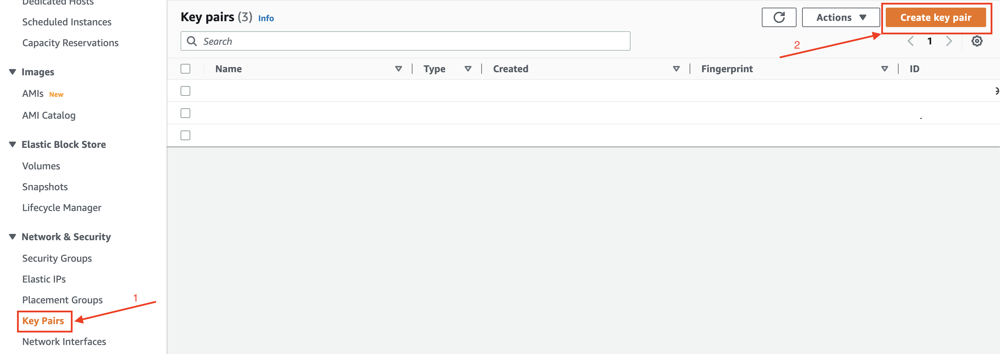
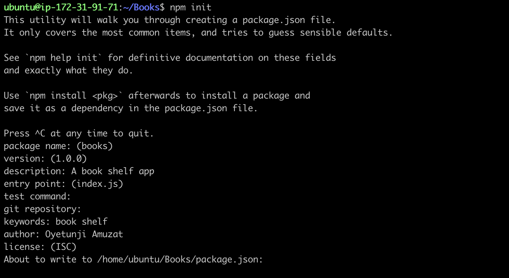
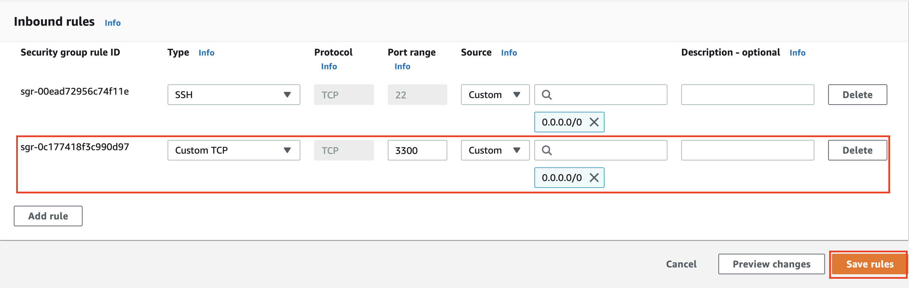
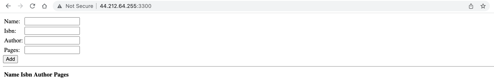

# MEAN STACK DEPLOYMENT ON UBUNTU IN AWS

MEAN Stack is a combination of following components:
- MongoDB (Document database) – Stores and allows to retrieve data.
- Express (Back-end application framework) – Makes requests to Database for Reads and Writes.
- Angular (Front-end application framework) – Handles Client and Server Requests.
- Node.js (JavaScript runtime environment) – Accepts requests and displays results to end user.

### Prerequisite :wrench:
- AWS Account

## Launch EC2 on AWS
- Login to the aws account
- Select region from the right hand corner of the dashboard


- Create a keypair from the ec2 instance dashboard and download it

- Launch an ec2 instance of t2.micro family with ubuntu server 20.04 LTS (HVM)


## SSH into the instance
- Open terminal on your local system and navigate to the folder where the key pair is downloaded
```
$ cd ~/Downloads
```
- Change permissions for private key file (.pem)
```
$ chmod 0400 <private-key-name>.pem
```
- Connect to the instance by running
```
$ ssh -i <private-key-name>.pem ubuntu@<public-ip-address>
```


## Install NodeJs
> Node.js is a JavaScript runtime built on Chrome’s V8 JavaScript engine. Node.js is used in this tutorial to set up the Express routes and AngularJS controllers.

- Update ubuntu
```
$ sudo apt update
```
- Upgrade ubuntu
```
$ sudo apt upgrade
```
- Add certificates
```
$ sudo apt -y install curl dirmngr apt-transport-https lsb-release ca-certificates

$ curl -sL https://deb.nodesource.com/setup_12.x | sudo -E bash -
```
- Install NodeJS
```
$ sudo apt install -y nodejs
```

## Install MongoDB
MongoDB stores data in flexible, JSON-like documents. Fields in a database can vary from document to document and data structure can be changed over time. For our example application, we are adding book records to MongoDB that contain book name, isbn number, author, and number of pages.

- Import the public key used by the package management system.
```
$ wget -qO - https://www.mongodb.org/static/pgp/server-6.0.asc | sudo apt-key add -
```
```
$ echo "deb [ arch=amd64,arm64 ] https://repo.mongodb.org/apt/ubuntu focal/mongodb-org/6.0 multiverse" | sudo tee /etc/apt/sources.list.d/mongodb-org-6.0.list
```
- Update ubuntu
```
sudo apt update
```
- Install MongoDB
```
$ sudo apt install -y mongodb-org
```
- Start The server
```
$ sudo systemctl start mongod
```
- Verify that the service is up and running
```
$ sudo systemctl status mongod
```
- Install npm – Node package manager.
```
$ sudo apt install -y npm
```
- Install body-parser package

```
$ sudo npm install body-parser
```
> We need `body-parser` package to help us process JSON files passed in requests to the server.
- Create a folder named `Books` and enter the directory
```
$ mkdir Books && cd Books
```
- In the `Books` directory, Initialize npm project
```
$ npm init
```

- Add a file named `server.js`
```
$ vi server.js
```
- Copy and paste the web server code below into the `server.js` file.
```
var express = require('express');
var bodyParser = require('body-parser');
var app = express();
app.use(express.static(__dirname + '/public'));
app.use(bodyParser.json());
require('./apps/routes')(app);
app.set('port', 3300);
app.listen(app.get('port'), function() {
    console.log('Server up: http://localhost:' + app.get('port'));
});
```

## Install Express and set up routes to the server
> Express is a minimal and flexible Node.js web application framework that provides features for web and mobile applications. We will use Express to pass book information to and from our MongoDB database.

> We will also use Mongoose package which provides a straight-forward, schema-based solution to model our application data. We will use Mongoose to establish a schema for the database to store data of our book register.
```
$ sudo npm install express mongoose
```
- In `Books` folder, create a folder named `apps`
```
$ mkdir apps && cd apps
```
- Create a file named `routes.js`
```
$ vi routes.js
```
- Copy and paste the code below into `routes.js`
```
var Book = require('./models/book');
module.exports = function(app) {
  app.get('/book', function(req, res) {
    Book.find({}, function(err, result) {
      if ( err ) throw err;
      res.json(result);
    });
  }); 
  app.post('/book', function(req, res) {
    var book = new Book( {
      name:req.body.name,
      isbn:req.body.isbn,
      author:req.body.author,
      pages:req.body.pages
    });
    book.save(function(err, result) {
      if ( err ) throw err;
      res.json( {
        message:"Successfully added book",
        book:result
      });
    });
  });
  app.delete("/book/:isbn", function(req, res) {
    Book.findOneAndRemove(req.query, function(err, result) {
      if ( err ) throw err;
      res.json( {
        message: "Successfully deleted the book",
        book: result
      });
    });
  });
  var path = require('path');
  app.get('*', function(req, res) {
    res.sendfile(path.join(__dirname + '/public', 'index.html'));
  });
};
```
In the `apps` folder, create a folder named `models`
```
$ mkdir models && cd models
```
- Create a file named `book.js`
```
$ vi book.js
```
- Copy and paste the code below into `book.js`
```
var mongoose = require('mongoose');
var dbHost = 'mongodb://localhost:27017/test';
mongoose.connect(dbHost);
mongoose.connection;
mongoose.set('debug', true);
var bookSchema = mongoose.Schema( {
  name: String,
  isbn: {type: String, index: true},
  author: String,
  pages: Number
});
var Book = mongoose.model('Book', bookSchema);
module.exports = mongoose.model('Book', bookSchema);
```

## Access the routes with AngularJS
> AngularJS provides a web framework for creating dynamic views in your web applications. In this tutorial, we use AngularJS to connect our web page with Express and perform actions on our book register.

- Change the directory back to `Books`
```
$ cd ../..
```
- Create a folder named `public`
```
$ mkdir public && cd public
```
- Add a file named `script.js`
```
$ vi script.js
```
- Copy and paste the Code below (controller configuration defined) into the `script.js` file.
```
var app = angular.module('myApp', []);
app.controller('myCtrl', function($scope, $http) {
  $http( {
    method: 'GET',
    url: '/book'
  }).then(function successCallback(response) {
    $scope.books = response.data;
  }, function errorCallback(response) {
    console.log('Error: ' + response);
  });
  $scope.del_book = function(book) {
    $http( {
      method: 'DELETE',
      url: '/book/:isbn',
      params: {'isbn': book.isbn}
    }).then(function successCallback(response) {
      console.log(response);
    }, function errorCallback(response) {
      console.log('Error: ' + response);
    });
  };
  $scope.add_book = function() {
    var body = '{ "name": "' + $scope.Name + 
    '", "isbn": "' + $scope.Isbn +
    '", "author": "' + $scope.Author + 
    '", "pages": "' + $scope.Pages + '" }';
    $http({
      method: 'POST',
      url: '/book',
      data: body
    }).then(function successCallback(response) {
      console.log(response);
    }, function errorCallback(response) {
      console.log('Error: ' + response);
    });
  };
});
```
- In public folder, create a file named `index.html`;
```
$ vi index.html
```
- Copy and paste the code below into index.html file.
```
<!doctype html>
<html ng-app="myApp" ng-controller="myCtrl">
  <head>
    <script src="https://ajax.googleapis.com/ajax/libs/angularjs/1.6.4/angular.min.js"></script>
    <script src="script.js"></script>
  </head>
  <body>
    <div>
      <table>
        <tr>
          <td>Name:</td>
          <td><input type="text" ng-model="Name"></td>
        </tr>
        <tr>
          <td>Isbn:</td>
          <td><input type="text" ng-model="Isbn"></td>
        </tr>
        <tr>
          <td>Author:</td>
          <td><input type="text" ng-model="Author"></td>
        </tr>
        <tr>
          <td>Pages:</td>
          <td><input type="number" ng-model="Pages"></td>
        </tr>
      </table>
      <button ng-click="add_book()">Add</button>
    </div>
    <hr>
    <div>
      <table>
        <tr>
          <th>Name</th>
          <th>Isbn</th>
          <th>Author</th>
          <th>Pages</th>

        </tr>
        <tr ng-repeat="book in books">
          <td>{{book.name}}</td>
          <td>{{book.isbn}}</td>
          <td>{{book.author}}</td>
          <td>{{book.pages}}</td>

          <td><input type="button" value="Delete" data-ng-click="del_book(book)"></td>
        </tr>
      </table>
    </div>
  </body>
</html>
```
- Change the directory back up to `Books`
```
$ cd ..
```
- Start the server by running this command:
```
$ node server.js
```
- The server is now up and running, we can connect it via port 3300. You can launch a separate Putty or SSH console to test what curl command returns locally.
```
$ curl -s http://localhost:3300
```
It shall return an HTML page, it is hardly readable in the CLI, but we can also try and access it from the Internet.

- Open TCP port 3300 in your AWS Web Console for your EC2 Instance.


- Access the web application from the internet with a browser using Public IP address or Public DNS name.
```
http://<Public-IP-Address>:3300
```

