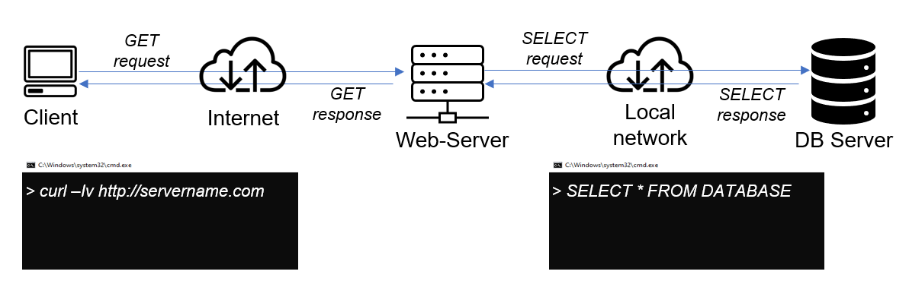
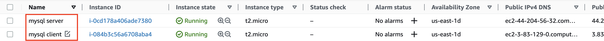
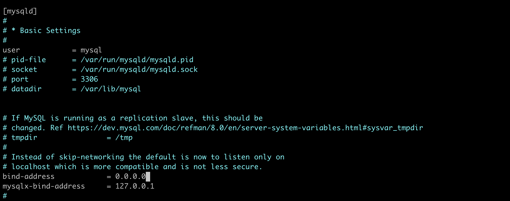
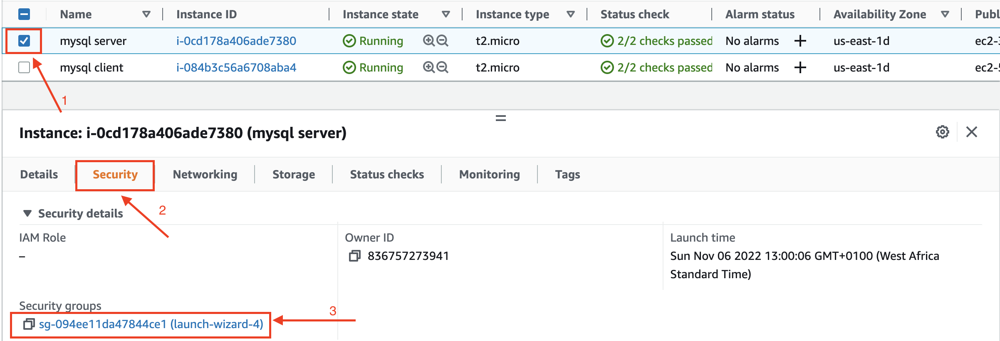
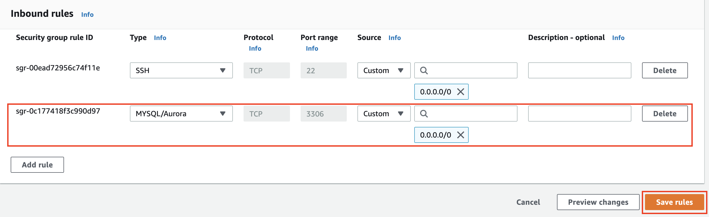
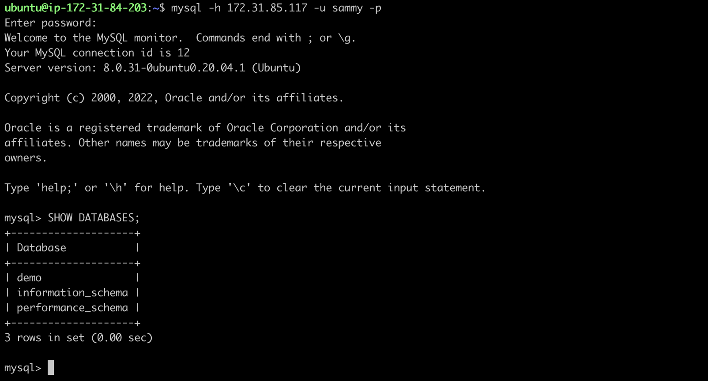

# Implementing a Client-Server Architecture With MySQL Database
Client-Server refers to an architecture in which two or more computers are connected together over a network to send and receive requests between one another. The machine sending requests is usually referred to as "Client" and the machine responding (serving) is called "Server".

A simple diagram of Web Client-Server architecture is presented below:


In the example above, the machine that sent the request is the client and the machine that responds is the server.

If we extend this concept further and add a database server to the architecture, we can get this picture below:


In this case, our Web Server has a role of a "Client" that connects and reads/writes to/from a Database (DB) Server and the communication between them happens over a Local Network.


To demonstrate a basic client-server using MySQL Relational Database Management System (RDBMS), follow the below instructions

- Create and configure two Linux-based virtual servers and ensure they are in the same VPC. If you are new to aws, check out this [video](https://www.youtube.com/watch?v=fsjs8XTi8JI) for mac user or this [video](https://www.youtube.com/watch?v=kzLRxVgos2M) for windows 10 user.
> For this tutorial, I'll be using ubuntu 22.04 LTS (HVM) for the client and database server.
```
Server A name - `mysql server`
Server B name - `mysql client`
```


- Connect to the instances.
```
$ ssh -i <private-key-name>.pem ubuntu@<public-ip-address>
```
- Update ubuntu packages on the 2 instances.
```
$ sudo apt update
```
- Install MySQL-Server software on mysql server instance.
```
$ sudo apt install mysql-server -y
```
- Configure MySQL server to allow connections from remote hosts.
```
$ sudo vi /etc/mysql/mysql.conf.d/mysqld.cnf
```

Change the bind address from `127.0.0.1` to `0.0.0.0` as shown in the screeshot above
- Save the file using `ecs` `:wq` then restart mysql
```
$ sudo systemctl restart mysql
```
- Login to mysql console and create a user on mysql server.
```
$ sudo mysql

mysql> CREATE USER 'sammy'@'%' IDENTIFIED WITH mysql_native_password BY 'password';
```
- Create a demo database
```
mysql> CREATE DATABASE demo;
```
- Grant the user access to the database
```
mysql> GRANT ALL ON demo.* TO 'sammy'@'%' WITH GRANT OPTION;
```
- Open TCP port 3306 for mysql server instance from the security group.




- Install MySQL Client software on mysql client instance.
```
$ sudo apt install mysql-client
```

- Connect remotely to mysql database with the command below and input 'password' at the password prompt.
```
$ mysql -h <mysql_server_private_ip_address> -u sammy -p
```
- Check that you have successfully connected to a remote mysql server and can perform SQL queries:
```
mysql> SHOW DATABASES;
```
If you see an output similar to the below image, then you have successfully completed this project – you have deloyed a fully functional MySQL Client-Server set up.



