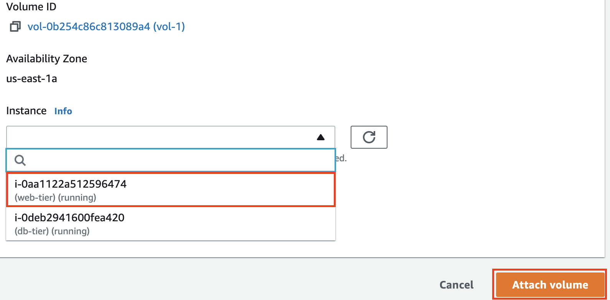
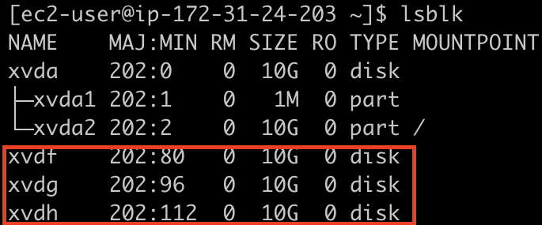
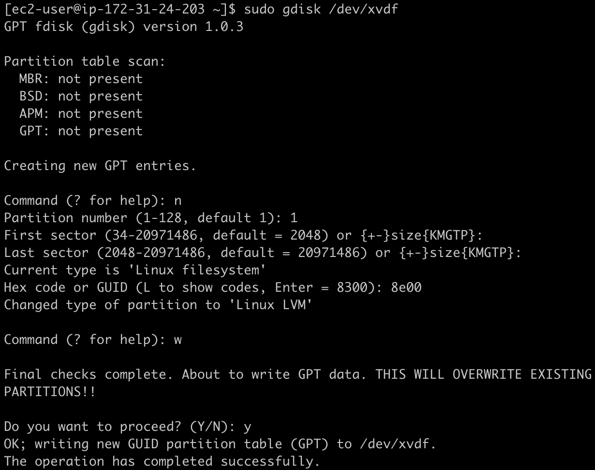
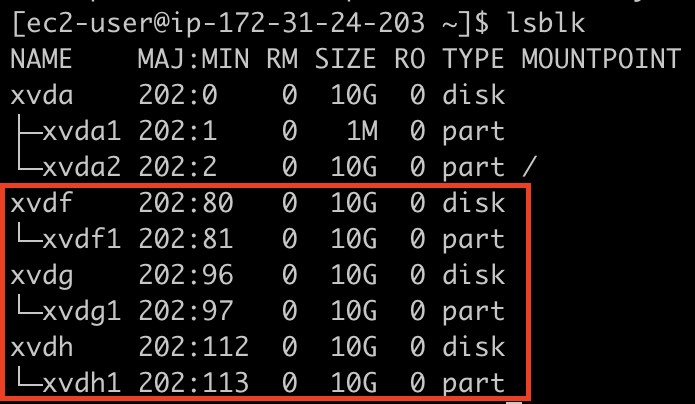
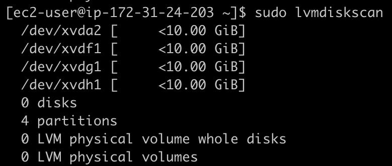
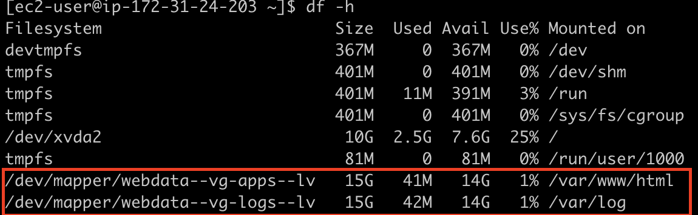

# Web Solution With Wordpress

WordPress is a free and open-source content management system written in PHP and paired with MySQL or MariaDB as its backend Relational Database Management System (RDBMS).

This documentation consists of two parts:

1. Configuring storage subsystem for Web and Database servers based on Linux OS.
2. Install WordPress and connect it to a remote MySQL database server.

## Prepare a Web Server
- Launch a Redhat EC2 instance that will serve as "Web Server".

- Create 3 volumes in the same availability zone as your Web Server, each of 10 GiB and attach them to the server.



- Connect to the instances
```
ssh -i <private-key-name>.pem ec2-user@<public-ip-address>
```
- Inspect what block devices are attached to the server and notice the names of your newly created devices.
```
$ lsblk
```

> All devices in Linux reside in `/dev/` directory. Inspect it with `ls /dev/` and make sure you see all 3 newly created block devices there. Their names will likely be xvdf, xvdh, xvdg.
- Update RedHat packages
```
$ sudo yum update -y
```
- Check all mounts and free space on your server
```
$ df -h
```

- Create a single partition on each of the 3 disks.
```
$ sudo gdisk /dev/xvdf
```

- Repeat the same process for `xvdg` and `xvdh`.

- View the newly configured partition on each of the 3 disks.
```
$ lsblk
```


- Install `lvm2` package
```
$ sudo yum install lvm2
```
- Check for available partitions on the server.
```
$ sudo lvmdiskscan
```

- Mark each of the 3 disks as physical volumes (PVs) to be used by LVM.
```
$ sudo pvcreate /dev/xvdf1 /dev/xvdg1 /dev/xvdh1
```
- Verify that your Physical volume has been created successfully.
```
$ sudo pvs
```


- Add all the 3 PVs to a volume group (VG) and name the VG `webdata-vg`.
```
$ sudo vgcreate webdata-vg /dev/xvdf1 /dev/xvdg1 /dev/xvdh1
```
- Verify that your VG has been created successfully.
```
$ sudo vgs
```


- Create 2 logical volumes from the VG. `apps-lv` (Use half of the PV size), and `logs-lv` Use the remaining space of the PV size.
```
$ sudo lvcreate -n apps-lv -L 15G webdata-vg
$ sudo lvcreate -n logs-lv -l +100%FREE webdata-vg
```
> NOTE: `apps-lv` will be used to store data for the Website while, `logs-lv` will be used to store data for logs.
- Verify that your Logical Volume has been created successfully.
```
$ sudo lvs
```


- Verify the entire setup.
```
$ lsblk
```


- Format the logical volumes with ext4 filesystem.
```
$ sudo mkfs -t ext4 /dev/webdata-vg/apps-lv
$ sudo mkfs -t ext4 /dev/webdata-vg/logs-lv
```
- Create `/var/www/html` directory to store website files.
```
$ sudo mkdir -p /var/www/html
```
- Create `/home/recovery/logs` to store backup of log data.
```
$ sudo mkdir -p /home/recovery/logs
```
- Mount `/var/www/html` on `apps-lv` logical volume.
```
$ sudo mount /dev/webdata-vg/apps-lv /var/www/html/
```
- Backup all the files in the log directory `/var/log` to `/home/recovery/logs`
```
$ sudo rsync -av /var/log/ /home/recovery/logs/
```
> This is required before mounting the filesystem to prevent log data loss.

- Mount `/var/log` on `logs-lv` logical volume.
```
$ sudo mount /dev/webdata-vg/logs-lv /var/log
```
> Note: all the existing data on /var/log will be deleted. That is why the previous step is very important

- Restore log files back into `/var/log` directory
```
$ sudo rsync -av /home/recovery/logs/ /var/log/
```
### Update the `/etc/fstab` for mount persistence after server restart

- Check the UUID of the device. The UUID of the device will be used to update the `/etc/fstab` file.
```
$ sudo blkid
```


- Open the `fstab` file
```
$ sudo vi /etc/fstab
```
- Update `/etc/fstab` following the screenshot below using your own UUID and rememeber to remove the leading and ending quotes.


- Test the configuration and reload the daemon
```
 $ sudo mount -a
 $ sudo systemctl daemon-reload
 ```
 - Verify your setup.
 ```
 $ df -h
 ```


 ## Prepare the Database Server

- Launch a second RedHat EC2 instance that will server as "DB Server"

- Repeat the same steps as for the Web Server, but instead of `apps-lv` create `db-lv` and mount it to `/db` directory instead of `/var/www/html/`.


## Install WordPress on your Web Server EC2

- Install wget, Apache and it’s dependencies
```
$ sudo yum -y install wget httpd php php-mysqlnd php-fpm php-json
```
- Start Apache
```
$ sudo systemctl enable httpd
$ sudo systemctl start httpd
```
- Install PHP and it’s dependencies
```
$ sudo yum install https://dl.fedoraproject.org/pub/epel/epel-release-latest-8.noarch.rpm
$ sudo yum install yum-utils http://rpms.remirepo.net/enterprise/remi-release-8.rpm
$ sudo yum module list php
$ sudo yum module reset php
$ sudo yum module enable php:remi-7.4
$ sudo yum install php php-opcache php-gd php-curl php-mysqlnd
$ sudo systemctl start php-fpm
$ sudo systemctl enable php-fpm
$ sudo setsebool -P httpd_execmem 1
```
- Restart Apache
```
$ sudo systemctl restart httpd
```
- Download wordpress and copy it to `var/www/html`
```
$ mkdir wordpress
$ cd wordpress
$ wget http://wordpress.org/latest.tar.gz
$ tar xzvf latest.tar.gz
$ rm -rf latest.tar.gz
$ cp wordpress/wp-config-sample.php wordpress/wp-config.php
$ sudo cp -R wordpress /var/www/html/
```
- Configure SELinux Policies
```
$ sudo chown -R apache:apache /var/www/html/wordpress
$ sudo chcon -t httpd_sys_rw_content_t /var/www/html/wordpress -R
$ sudo setsebool -P httpd_can_network_connect=1
  ```
## Install and Configure MySQL on the DB Server EC2
- Install mysql on the db server
```
$ sudo yum install -y mysql-server
```
- Verify that the service is up and running.
```
$ sudo systemctl status mysqld
```
- If it is not running, restart and enable the service so it will be running even after reboot:
```
$ sudo systemctl restart mysqld
$ sudo systemctl enable mysqld
```
## Configure DB to work with WordPress
```
$ sudo mysql
```
```
mysql> CREATE DATABASE wordpress;
mysql> CREATE USER `myuser`@`<Web-Server-Private-IP-Address>` IDENTIFIED BY 'password';
mysql> GRANT ALL ON wordpress.* TO 'myuser'@'<Web-Server-Private-IP-Address>';
mysql> FLUSH PRIVILEGES;
mysql> SHOW DATABASES;
mysql> exit
```
- Enable TCP port 3306 in the inbound rule configuration of the database server security group from the web server cidr source.


## Configure WordPress to connect to remote database.

- Install MySQL client and test that you can connect from your Web Server to your DB server by using mysql-client.
```
$ sudo yum install mysql
$ sudo mysql -u myuser -p -h <DB-Server-Private-IP-address>
```
- Verify if you can successfully execute `SHOW DATABASES;` command and confirm the `wordpress` database.


- Update the `wp-config.php` file with the database details.
```
$ sudo vi /var/www/html/wordpress/wp-config.php
```
- Enable TCP port 80 in Inbound Rules configuration for your Web Server EC2 from everywhere `0.0.0.0/0`.

- Access the wordpress site from your browser.
```
http://<Web-Server-Public-IP-Address>/wordpress/
```


- Fill in your details and install wordpress
- Login to your wordpress app.
