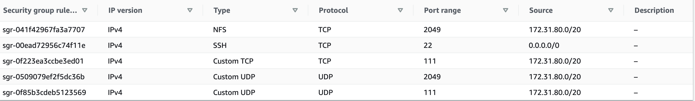

# DevOPs Tooling Website Solution

This project is an implementation of a tooling website solution that makes access to DevOps tools within the corporate infrastructure easily accessible.

The tools we want our team to be able to use are well known and widely used by multiple DevOps teams, so we will introduce a single DevOps Tooling Solution that will consist of:

- Jenkins – free and open source automation server used to build CI/CD pipelines.

- Kubernetes – an open-source container-orchestration system for automating computer application deployment, scaling, and management of containerized applications.

- Jfrog Artifactory – Universal Repository Manager supporting all major packaging formats, build tools and CI servers.

- Rancher – an open source software platform that enables organizations to run and manage Docker and Kubernetes in production.

- Grafana – a multi-platform open source analytics and interactive visualization web application.

- Prometheus – An open-source monitoring system with a dimensional data model, flexible query language, efficient time series database and modern alerting approach.

- Kibana – Kibana is a free and open user interface that lets you visualize your Elasticsearch data and navigate the Elastic Stack.

Implementation of this solution is based on the following components:

- Infrastructure: AWS

- Webserver Linux: Red Hat Enterprise Linux 8
- Database Server: Ubuntu 20.04 + MySQL
- Storage Server: Red Hat Enterprise Linux 8 + NFS Server
- Programming Language: PHP
- Code Repository: GitHub

The diagram below shows the architecture of this project. It shows a common pattern of several stateless web server sharing a database and also accessing the same files using Network File System (NFS) as a shared file storage.


## Prepare the NFS Server

- Launch an EC2 instance with RHEL Linux 8 Operating System as NFS server.

- Create 3 volumes in the same availability zone as your Web Server, each of 10 GiB and attach them to the server.


- Connect to the instances
```
ssh -i <private-key-name>.pem ec2-user@<public-ip-address>
```
- Inspect what block devices are attached to the server and notice the names of your newly created devices.
```
$ lsblk
```

> All devices in Linux reside in `/dev/` directory. Inspect it with `ls /dev/` and make sure you see all 3 newly created block devices there. Their names will likely be `xvdf`, `xvdh`, `xvdg`.

- Update RedHat packages
```
$ sudo yum update -y
```
- Check all mounts and free space on your server
```
$ df -h
```

- Create a single partition on each of the 3 disks.
```
$ sudo gdisk /dev/xvdf
```

- Repeat the same process for `xvdg` and `xvdh`.

- View the newly configured partition on each of the 3 disks.
```
$ lsblk
```


- Install `lvm2` package
```
$ sudo yum install lvm2 -y
```
- Check for available partitions on the server.
```
$ sudo lvmdiskscan
```

- Mark each of the 3 disks as physical volumes (PVs) to be used by LVM.
```
$ sudo pvcreate /dev/xvdf1 /dev/xvdg1 /dev/xvdh1
```
- Verify that your Physical volume has been created successfully.
```
$ sudo pvs
```


- Add all the 3 PVs to a volume group (VG) and name the VG `webdata-vg`.
```
$ sudo vgcreate webdata-vg /dev/xvdf1 /dev/xvdg1 /dev/xvdh1
```
- Verify that your VG has been created successfully.
```
$ sudo vgs
```


- Create 3 logical volumes from the VG. `lv-apps 14GiB`, `lv-logs 8GiB` and `lv-opt` takes the remaining space of the VG.
```
$ sudo lvcreate -n lv-apps -L 14G webdata-vg
$ sudo lvcreate -n lv-logs -L 8G webdata-vg
$ sudo lvcreate -n lv-opt -l +100%FREE webdata-vg
```
> NOTE: `lv-apps` will be used to store website data while, `lv-logs` will be used to store log data and `lv-opt` is used by the jenkins server.

- Verify that your Logical Volume has been created successfully.
```
$ sudo lvs
```


- Verify the entire setup.
```
$ lsblk
```


- Format the logical volumes with xfs filesystem.
```
$ sudo mkfs.xfs /dev/webdata-vg/lv-apps
$ sudo mkfs.xfs /dev/webdata-vg/lv-logs
$ sudo mkfs.xfs /dev/webdata-vg/lv-opt
```
- Create mount points on `/mnt` directory for `lv-apps` and mount the volume on the directory.
```
$ sudo mkdir /mnt/apps
$ sudo mount /dev/webdata-vg/lv-apps /mnt/apps/
```
- Create mount points on `/mnt` directory for `lv-logs` and mount the volume on the directory.
```
$ sudo mkdir /mnt/logs
$ sudo mount /dev/webdata-vg/lv-logs /mnt/logs/
```
- Create mount points on `/mnt` directory for `lv-opt` and mount the volume on the directory.
```
$ sudo mkdir /mnt/opt
$ sudo mount /dev/webdata-vg/lv-opt /mnt/opt/
```

### Update the `/etc/fstab` for mount persistence after server restart

- Check the UUID of the device. The UUID of the device will be used to update the `/etc/fstab` file;
```
$ sudo blkid
```


- Open the `fstab` file
```
$ sudo vi /etc/fstab
```
- Update `/etc/fstab` following the screenshot below using your own UUID and rememeber to remove the leading and ending quotes.


- Test the configuration and reload the daemon
```
 $ sudo mount -a
 $ sudo systemctl daemon-reload
 ```
 - Verify your setup.
 ```
 $ df -h
 ```


- Install NFS server, configure it to start on reboot and make sure it is up and running.
```
$ sudo yum -y update
$ sudo yum install nfs-utils -y
$ sudo systemctl start nfs-server.service
$ sudo systemctl enable nfs-server.service
$ sudo systemctl status nfs-server.service
```
-  set up permission that will allow the Web servers to read, write and execute files on NFS:
```
$ sudo chown -R nobody: /mnt/apps
$ sudo chown -R nobody: /mnt/logs
$ sudo chown -R nobody: /mnt/opt

$ sudo chmod -R 777 /mnt/apps
$ sudo chmod -R 777 /mnt/logs
$ sudo chmod -R 777 /mnt/opt

$ sudo systemctl restart nfs-server.service
```
- Configure access to NFS for clients within the same subnet.
```
$ sudo vi /etc/exports
```
- Copy and paste the below text and replace the <Subnet-CIDR> with your subnet cidr where your instance is launched. Then save and exit with `esc + :wq!`
```
/mnt/apps <Subnet-CIDR>(rw,sync,no_all_squash,no_root_squash)
/mnt/logs <Subnet-CIDR>(rw,sync,no_all_squash,no_root_squash)
/mnt/opt <Subnet-CIDR>(rw,sync,no_all_squash,no_root_squash)
```

- Export the file share to the client
```
$ sudo exportfs -arv
```
- Check which port is used by NFS and open it using Security Groups.
```
$ rpcinfo -p | grep nfs
```
- Open following ports in the ibound rule: TCP 111, TCP 2049, UDP 111, UDP 2049 and the source will be from the subnet cidr.



## Configure the Database Server
- Launch Ubuntu 20.04 ec2 instance for the database.

- Update ubuntu package and install MySQL server.
```
$ sudo apt update
$ sudo apt install mysql-server
```
- Create a database and name it `tooling`
```
$ sudo mysql

mysql> CREATE DATABASE tooling;
```
- Create a database user and name it `webaccess`
```
mysql> CREATE USER 'webaccess'@'172.31.80.0/20' IDENTIFIED WITH mysql_native_password BY 'password';
```
- Grant permission to webaccess user on `tooling` database to do anything only from the webservers subnet cidr
```
mysql> GRANT ALL ON tooling.* TO 'webaccess'@'172.31.80.0/20' WITH GRANT OPTION;
```

## Prepare the Web Servers

- Launch 3 ec2 instances with RHEL 8 Operating System for the web servers and name them `web-server-1`, `web-server-2` and `web-server-3`.

- Update Redhat packages on the servers.
```
$ sudo yum update -y
```

- Install NFS client
```
$ sudo yum install nfs-utils nfs4-acl-tools -y
```
- Mount `/var/www/` and target the NFS server’s export for apps
```
$ sudo mkdir /var/www
$ sudo mount -t nfs -o rw,nosuid <NFS-Server-Private-IP-Address>:/mnt/apps /var/www
```
- On `web-server-1`, back up the log files from `/var/log` to `/home/recovery/logs` to prevent data loss.
```
$ sudo mkdir -p /home/recovery/logs

$ sudo rsync -av /var/log/ /home/recovery/logs/
```
- Mount `/var/log` and target the NFS server's export for logs on the 3 web servers.
```
$ sudo mount -t nfs -o rw,nosuid <NFS-Server-Private-IP-Address>:/mnt/logs /var/log
```
- Restore log files back into /var/log directory from the `web-server-1`
```
$ sudo rsync -av /home/recovery/logs/ /var/log/
```
- Verify that NFS was mounted successfully.
```
$ df -h
``` 


- Make the mounts persist on Web Servers after reboot by opening `fstab` on each server with `sudo vi /etc/fstab` and add following line:
```
<NFS-Server-Private-IP-Address>:/mnt/apps /var/www nfs defaults 0 0

<NFS-Server-Private-IP-Address>:/mnt/logs /var/log nfs defaults 0 0
```

- Install Remi’s repository, Apache and PHP
```
$ sudo yum install httpd -y

$ sudo dnf install https://dl.fedoraproject.org/pub/epel/epel-release-latest-8.noarch.rpm

$ sudo dnf install dnf-utils http://rpms.remirepo.net/enterprise/remi-release-8.rpm

$ sudo dnf module reset php

$ sudo dnf module enable php:remi-7.4

$ sudo dnf install php php-opcache php-gd php-curl php-mysqlnd

$ sudo systemctl start php-fpm

$ sudo systemctl enable php-fpm

$ sudo setsebool -P httpd_execmem 1
```

- Verify that Apache and log files and directories are available on the Web Servers in `/var/www` and `/var/log` and also on the NFS server in `/mnt/apps` and `/mnt/logs`. If you see the same files – it means NFS is mounted correctly.

- On `web-server-1`, install git and clone the `tooling` source code from [darey.io Github Account](https://github.com/darey-io/tooling)
```
$ sudo yum install git -y

$ git clone <github_clone_link>
```


- Deploy the tooling website’s code to the web servers. Ensure that the html folder from the repository is deployed to `/var/www/html`
```
$ sudo cp -R tooling/html/* /var/www/html/
```

- Open TCP port 80 on the web Servers security group.


- Update the website’s configuration to connect to the database (in `/var/www/html/functions.php` file).
```
$ vi /var/www/html/functions.php
```

- Enter the `tooling` directory and apply `tooling-db.sql` script to your database using this command;
```
mysql -h <databse-private-ip> -u <db-username> -p <db-name> < tooling-db.sql
```
- Create in MySQL a new admin user with username: myuser and password: password:
```
INSERT INTO users (id, username, password, email, user_type, status) VALUES (2, 'myuser', 'password', 'user@mail.com', 'admin', '1');
```

- Open the website in your browser and make sure you can login into the website with myuser user.
```
http://<Web-Server-Public-IP-Address-or-Public-DNS-Name>/index.php 
```


> If you encounter 403 Error – check permissions to your /var/www/html folder and also disable SELinux using `sudo setenforce 0`

> To make this change permanent – open selinux config file `sudo vi /etc/sysconfig/selinux` and set `SELINUX=disabled` then restart httpd.
