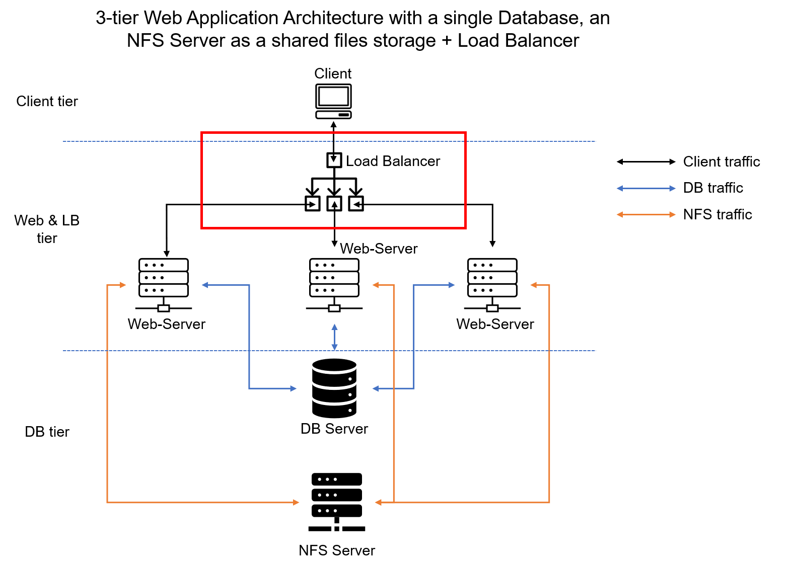
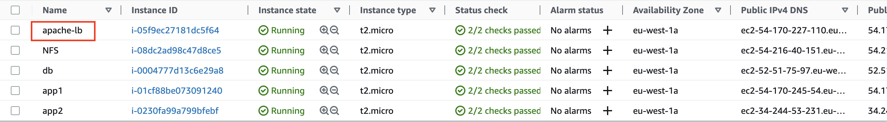
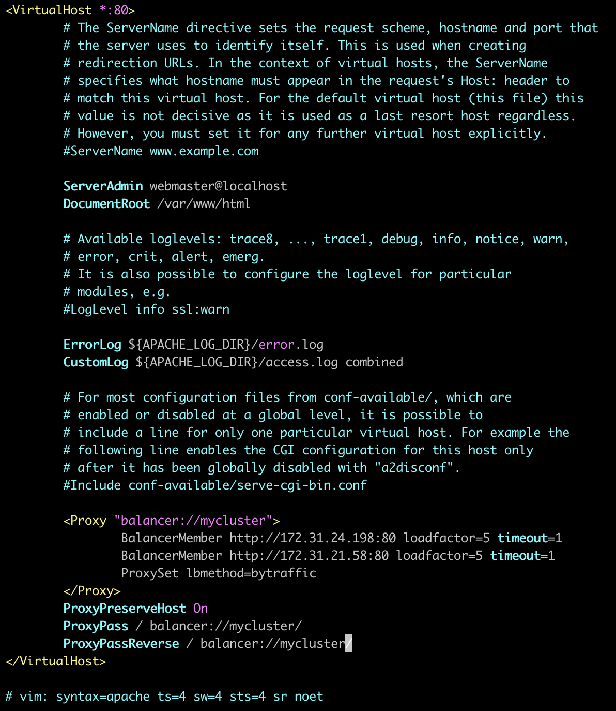
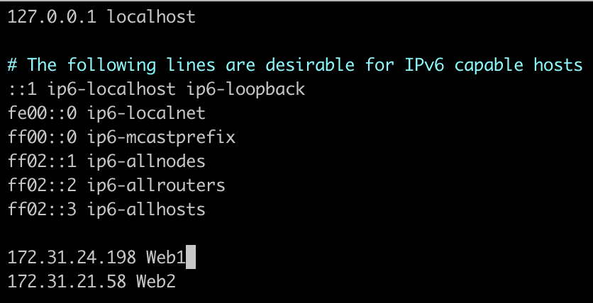
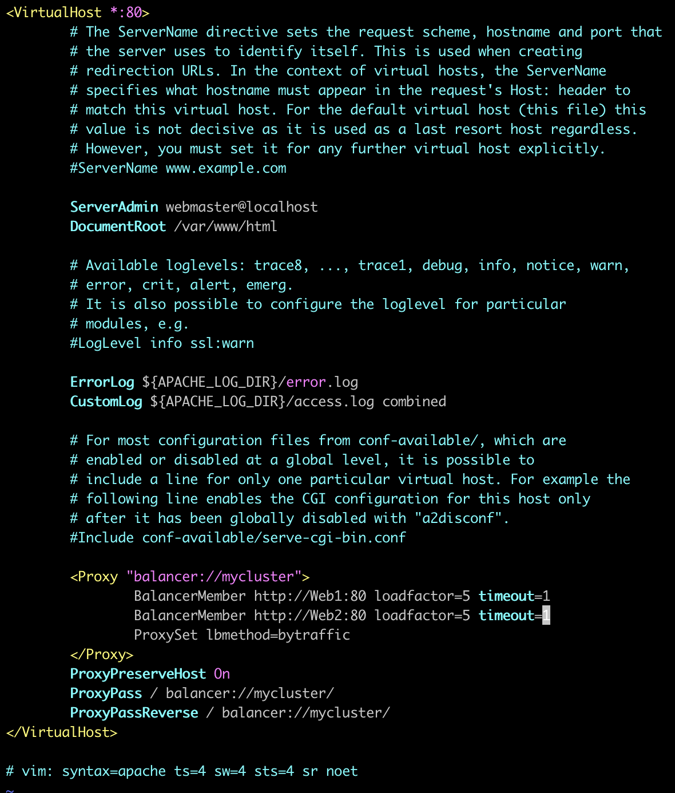

# Load Balancer Solution With Apache



- Launch an ec2 instance with ubuntu ami and name it `apache-lb`.


- Open TCP port 80 on `apache-lb` by creating an inbound rule in the security group.

- Connect to the instances
```
ssh -i <private-key-name>.pem ubuntu@<public-ip-address>
```

- Install apache2 on `apache-lb` server.
```
$ sudo apt update
$ sudo apt install apache2 -y
$ sudo apt-get install libxml2-dev
```
- Enable the following modules:
```
$ sudo a2enmod rewrite
$ sudo a2enmod proxy
$ sudo a2enmod proxy_balancer
$ sudo a2enmod proxy_http
$ sudo a2enmod headers
$ sudo a2enmod lbmethod_bytraffic
```
- Restart apache2 service
```
$ sudo systemctl restart apache2
```
- Make sure apache2 is up and running
```
$ sudo systemctl status apache2
```
- Configure load balancing
```
$ sudo vi /etc/apache2/sites-available/000-default.conf
```
- Add this configuration into this section `<VirtualHost *:80>  </VirtualHost>`
```
<Proxy "balancer://mycluster">
        BalancerMember http://<WebServer1-Private-IP-Address>:80 loadfactor=5 timeout=1
        BalancerMember http://<WebServer2-Private-IP-Address>:80 loadfactor=5 timeout=1
        ProxySet lbmethod=bytraffic
        # ProxySet lbmethod=byrequests
</Proxy>

ProxyPreserveHost On
ProxyPass / balancer://mycluster/
ProxyPassReverse / balancer://mycluster/
```


- Restart apache server
```
$ sudo systemctl restart apache2
```

- Verify that our configuration works by accessing the `apache-lb` public IP address or Public DNS name from your browser:
```
http://<Load-Balancer-Public-IP-Address-or-Public-DNS-Name>/index.php
```
> If in the [Project-7](https://github.com/Tunji-L/dareyio-pbl/blob/main/project7.md) you mounted `/var/log/httpd/` from your Web Servers to the NFS server, unmount them and make sure that each Web Server has its own log directory.

- Open two ssh consoles for both web servers and run following command:
```
sudo tail -f /var/log/httpd/access_log
```
- Refresh your browser page several times and make sure that both servers receive HTTP GET requests from your LB. New records must appear in each server’s log file. The number of requests to each server will be approximately the same since we set `loadfactor` to the same value for both servers – it means that traffic will be disctributed evenly between them.

### Configure Local DNS Names Resolution (Optional)
Sometimes it is tedious to remember and switch between IP addresses, especially if you have a lot of servers under your management.
What we can do is to configure local domain name resolution. The easiest way is to use /etc/hosts file, although this approach is not very scalable, but it is very easy to configure and shows the concept well. So let us configure IP address to domain name mapping for our LB.

- Open the `hosts` file on your `apache-lb` server
```
$ sudo vi /etc/hosts
```
- Add 2 records into this file with Local IP address and arbitrary name for both of the web servers
```
<WebServer1-Private-IP-Address> Web1
<WebServer2-Private-IP-Address> Web2
```

- Update your LB config file with those names instead of IP addresses.
```
BalancerMember http://Web1:80 loadfactor=5 timeout=1
BalancerMember http://Web2:80 loadfactor=5 timeout=1
```


- You can try to curl your Web Servers from LB locally curl http://Web1 or curl http://Web2 and it will work.