# Tooling Website Deployment Automation With Continous Integration

We'll enhance the architecture prepared in [Project 8](https://github.com/Tunji-L/dareyio-pbl/blob/main/project8.md) by adding a Jenkins server and configuring a job to automatically deploy source codes changes from Git to NFS server.

Here is how the updated architecture will look like upon completion of this project.
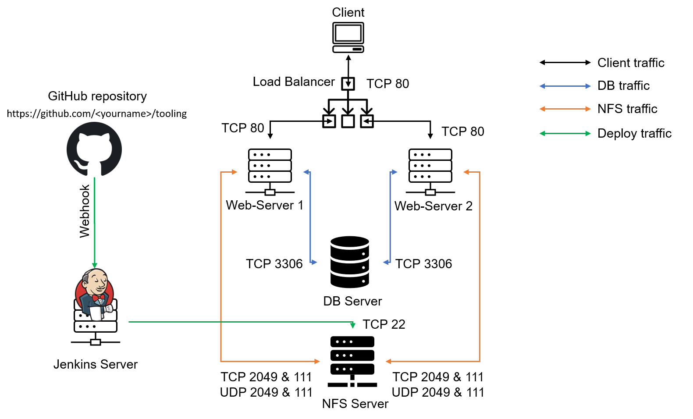

## Install Jenkins

- Create an AWS EC2 instance based on ubuntu server 20.04 LTS and name it `Jenkins`

- Connect to the `jenkins` instance.
```
ssh -i <private-key-name>.pem ubuntu@<public-ip-address>
```

- Update ubuntu packages and Install JDK (since Jenkins is a Java-based application)
```
$ sudo apt update
$ sudo apt install default-jdk-headless
```
- Confirm java is installed
```
$ java -version
```
- Install Jenkins
```
wget -q -O - https://pkg.jenkins.io/debian-stable/jenkins.io.key | sudo apt-key add -
sudo sh -c 'echo deb https://pkg.jenkins.io/debian-stable binary/ > \
    /etc/apt/sources.list.d/jenkins.list'
sudo apt update
sudo apt-get install jenkins
```
- Confirm Jenkins is up and running
```
$ sudo systemctl status jenkins
```
- Create a new inbound rule in your ec2 security group for Jenkins server and open tcp port 8080.

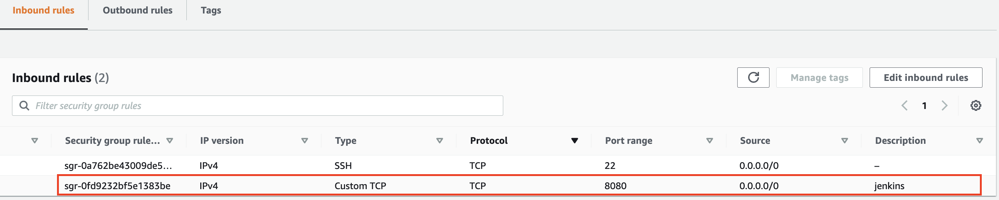

## Configure Jenkins

- Access `http://<Jenkins-Server-Public-IP-Address-or-Public-DNS-Name>:8080` from your browser. You will be prompted to provide a default admin password. Output the `initialAdminPassword` file, copy and paste the content in the provided space as directed by jenkins then continue.
```
$ sudo cat /var/lib/jenkins/secrets/initialAdminPassword
```
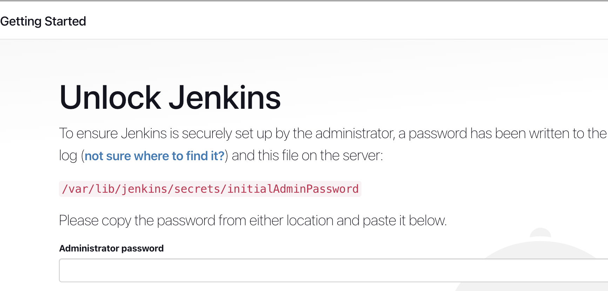

- Choose `Install suggested plugins` on the next page to install some Jenkins plugins and wait for the installation to be done.

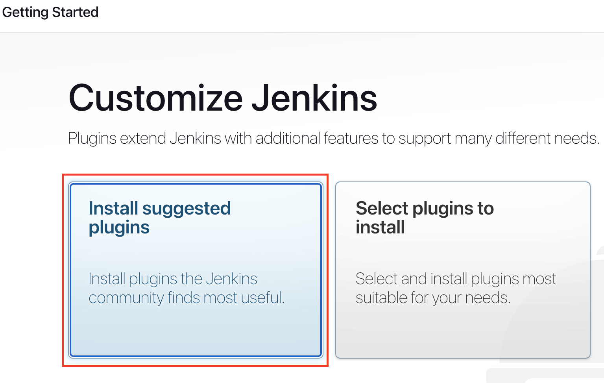

- Create an admin user by filling in the details on the next page. Then Jenkins will generate the Jenkins urls, save it and the installation is completed.

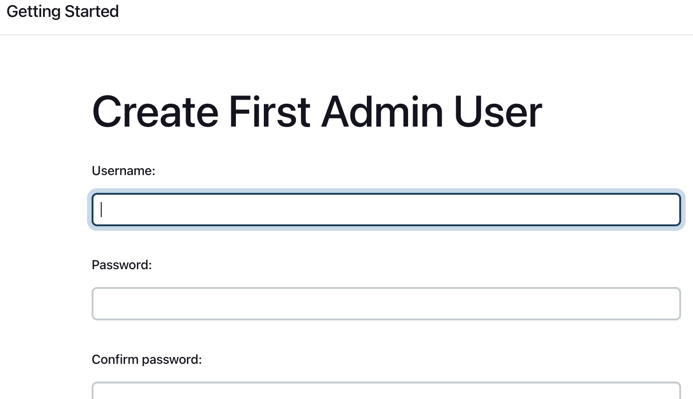
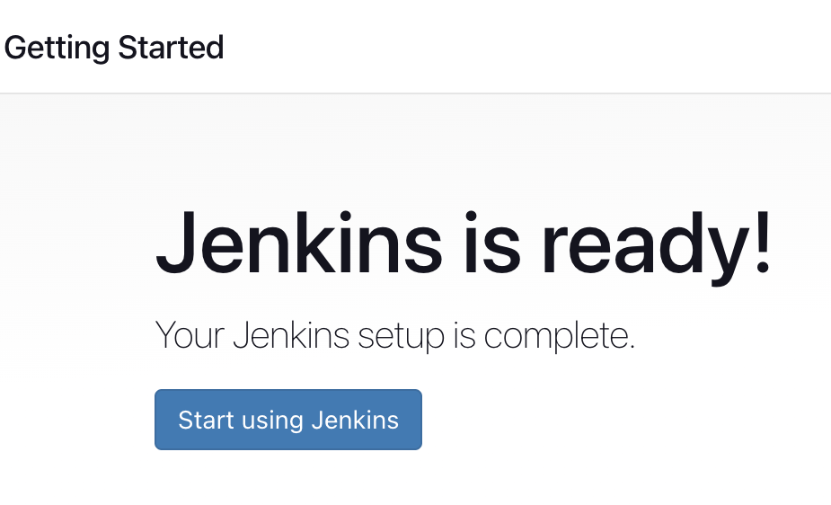

## Configure Jenkins to retrieve source codes from GitHub using Webhooks

> Configure a simple Jenkins job that will be triggered by GitHub webhooks and will execute a `build` task to retrieve codes from GitHub and store it locally on Jenkins server.

- Enable webhooks in your GitHub repository settings


- Go to Jenkins web console, click `New Item` and create a `Freestyle project` named `tooling_devops`.

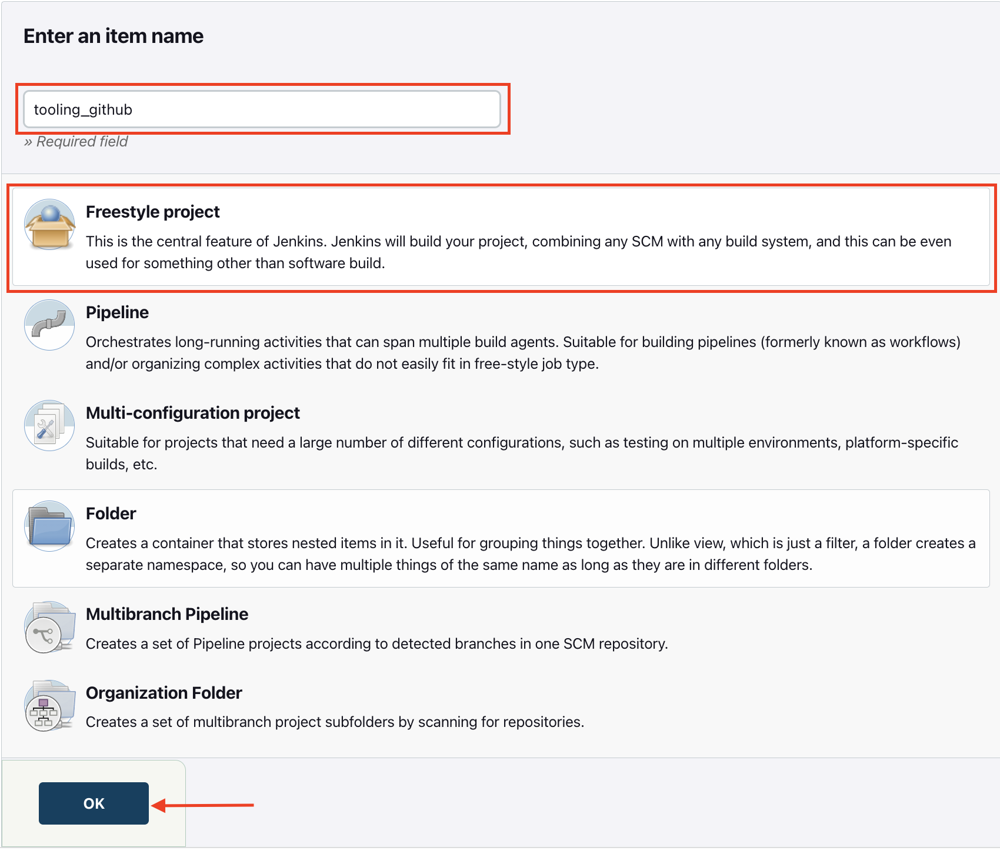

- Copy the repository URL from Github

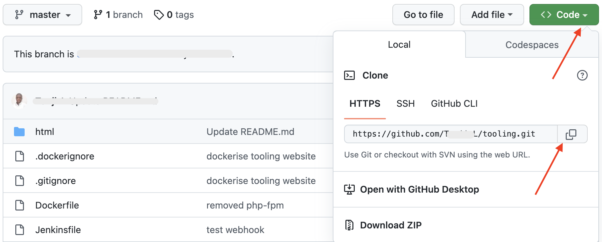

- In the configuration of your Jenkins freestyle project, choose `Git` in the `source code management` section and paste the link to your forked tooling GitHub repository then provide the credentials (user/password) so Jenkins could access files in the repository.

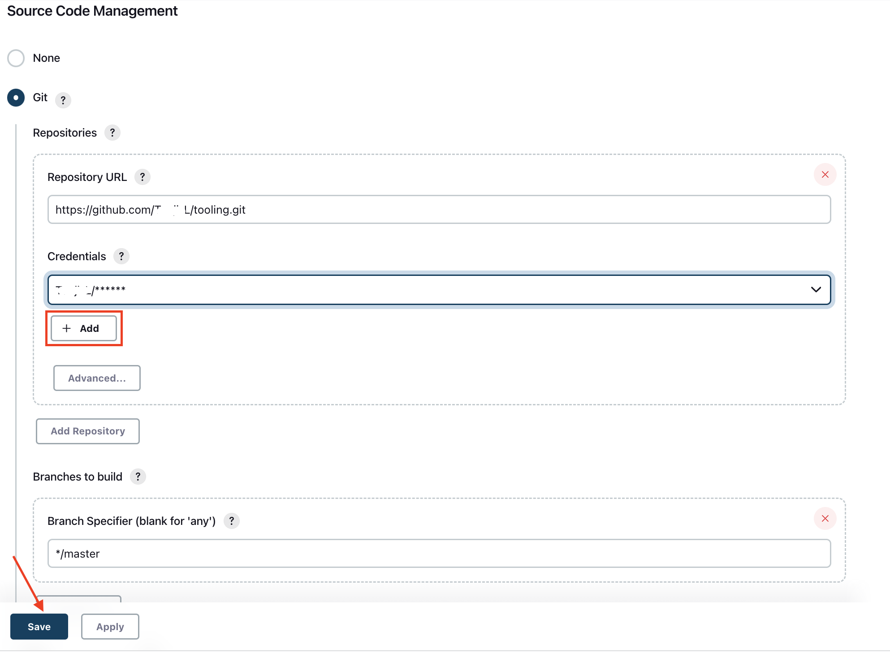

- Save the configuration and run the build manually by clicking on `Build Now`. If everything is configured correctly, the build will be successfull and the first build will be displayed as `#1`

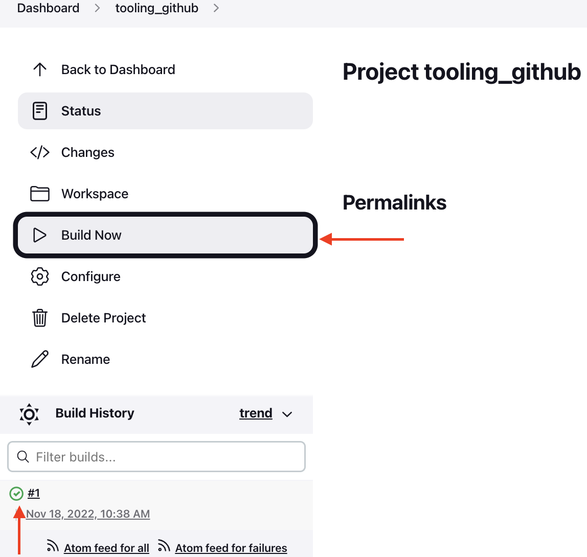

- Open the build and click on `Console Output` to view the output of the build.

- Go back to the project and click `Configure` to configure triggering from Github webhook. In the `build trigger` section, select `GitHub hook trigger from GITScm polling`.


- Configure `Post-build Actions` to archive all the artifacts – files resulted from a build are called "artifacts".


- Make some change in any file in your GitHub repository (e.g. README.MD file) and push the changes to the main branch. A new build will be launched automatically by webhook and you can see its results (artifacts) saved on Jenkins server.

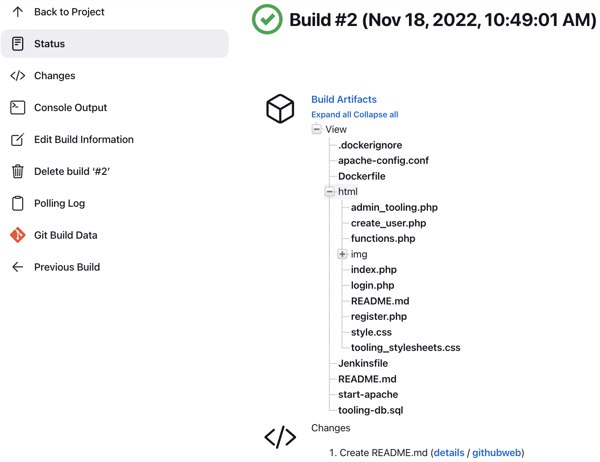

By default, the artifacts are stored on Jenkins server locally.
```
ls /var/lib/jenkins/jobs/tooling_github/builds/<build_number>/archive/
```

## Configure Jenkins to copy files to NFS server via SSH

Now we have our artifacts saved locally on Jenkins server, we'll copy them to our NFS server in the `/mnt/apps` directory.

- Go to the main dashboard, select `Manage Jenkins` and choose `Manage Plugins` from the menu items. On `Available` tab search for `Publish Over SSH` plugin and install it.

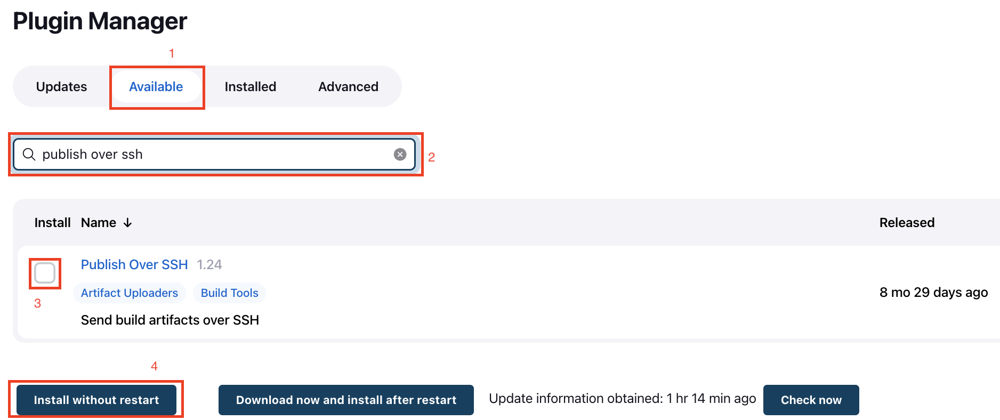

- Go to the main dashboard select `Manage Jenkins` and choose `Configure System` from menu items. Scroll down to `Publish over SSH` plugin configuration section and configure it to be able to connect to your NFS server, then test the configuration and make sure the connection returns `Success`.
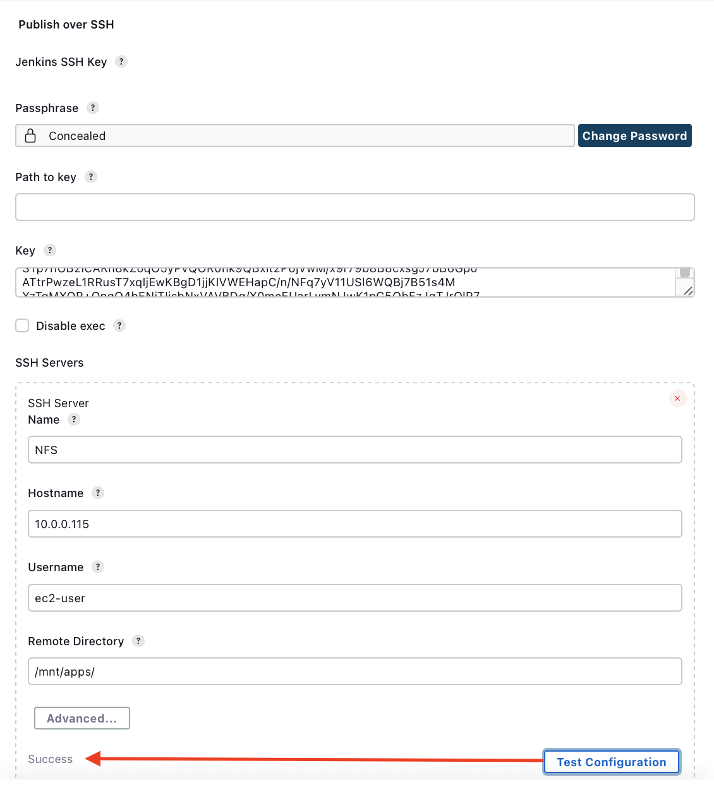

> - key - Provide a private key (content of .pem file that you use to connect to NFS server via SSH/Putty)
> - Name - Arbitrary name
> - Hostname – Private IP address of your NFS server
> - Username – ec2-user (since NFS server is based on EC2 with RHEL 8)
> - Remote directory – `/mnt/apps` since our Web Servers use it as a mointing point to retrieve files from the NFS server.

- Save the configuration, open your Jenkins job configuration page and add another "Post-build Action". Configure it to send all files produced by the build into our previously defined remote directory (`**` indicates copy all files and directories. You can read more about the pattern [here](https://ant.apache.org/manual/dirtasks.html#patterns)).

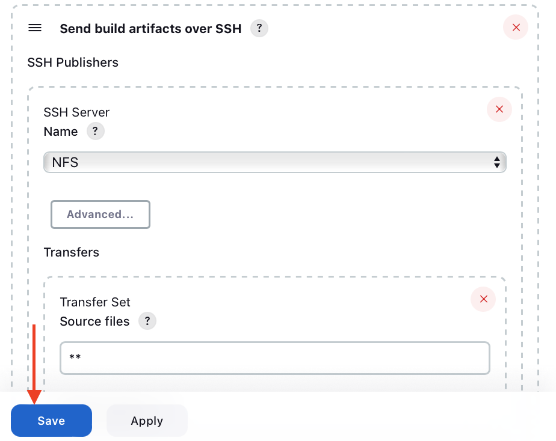

- Save this configuration and go ahead to change something in the `README.MD` file in your GitHub `tooling` repository. Webhook will trigger a new job and in the "Console Output" of the job you will see `SSH: Transferred 25 file(s)`

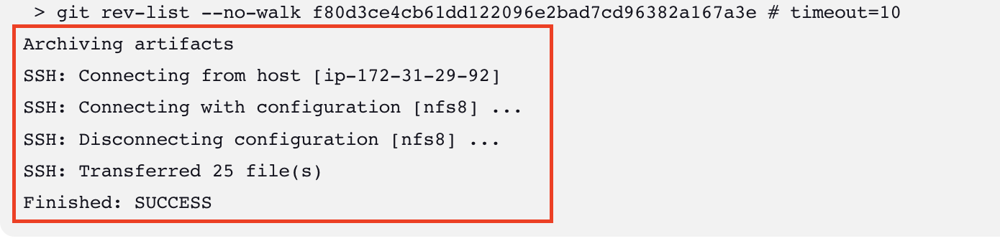

- Confirm the files in `/mnt/apps` have been udated by connecting via SSH/Putty to your NFS server and check `README.MD` file. If the changes you had previously made in your GitHub appear, the job works as expected.
```
cat /mnt/apps/README.md
```
